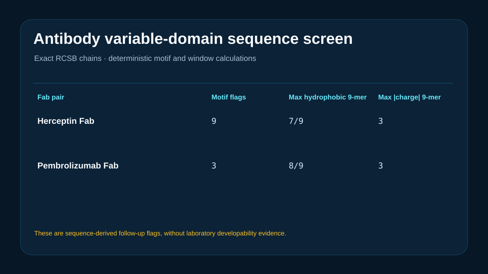

# Codex showcase lesson: Therapeutic antibody developability comparison

## Session prompt

Use $showcase-teacher to import and teach the ready showcase `rosalind-antibody-developability` (Therapeutic antibody developability comparison). Inspect its README, manifest, prompt, inputs, outputs, previews, and provenance records. Clearly distinguish source observations, computed results, scientific interpretation, and limitations, and show the preview when useful.

## Catalogue record

- Showcase ID: `rosalind-antibody-developability`
- Plugin: `rosalind-workbench` (Rosalind Workbench v0.2.2-research-preview)
- Status: `ready`
- Domain: `adme-and-developability`
- Case type: `analysis`
- Difficulty: `advanced`
- Evidence level: `multi-tool-result`
- Covered operations: `rosalind.rosalind_open`, `rosalind-workbench.public-evidence`
- Rosalind tasks: `assess-antibody-developability`
- Actual tools: `Rosalind Workbench mcp__rosalind__rosalind_open`, `RCSB PDB REST and FASTA`, `Python 3.14 standard library`
- Summary: How can sequence-derived liabilities be compared for two therapeutic antibodies?
- Recorded next step: Repeat the variable-domain motif, charge, pI, and hydrophobic-window calculations on the exact public Fab sequences.
- Plugin guide: `showcases/rosalind-workbench/README.md`

## Repository files to inspect

- case guide: `showcases/rosalind-workbench/cases/rosalind-antibody-developability/README.md`
- case manifest: `showcases/rosalind-workbench/cases/rosalind-antibody-developability/showcase.json`
- teaching prompt: `showcases/rosalind-workbench/cases/rosalind-antibody-developability/prompt.md`
- input: `showcases/rosalind-workbench/cases/rosalind-antibody-developability/inputs/public-source.md`
- input: `showcases/rosalind-workbench/cases/rosalind-antibody-developability/inputs/source-records.csv`
- input: `showcases/rosalind-workbench/cases/rosalind-antibody-developability/inputs/antibody-chains.fasta`
- input: `showcases/rosalind-workbench/cases/rosalind-antibody-developability/scripts/analyze.py`
- output: `showcases/rosalind-workbench/cases/rosalind-antibody-developability/outputs/sequence-metrics.csv`
- output: `showcases/rosalind-workbench/cases/rosalind-antibody-developability/outputs/motif-liabilities.csv`
- output: `showcases/rosalind-workbench/cases/rosalind-antibody-developability/outputs/result-summary.json`
- output: `showcases/rosalind-workbench/cases/rosalind-antibody-developability/outputs/rosalind-open-observation.json`
- output: `showcases/rosalind-workbench/cases/rosalind-antibody-developability/outputs/teaching-bundle.md`
- preview: `showcases/rosalind-workbench/cases/rosalind-antibody-developability/previews/preview.svg`

## Public sources

- https://www.rcsb.org/structure/1N8Z
- https://www.rcsb.org/structure/5DK3

## Retained case guide

# Therapeutic antibody sequence-liability comparison



## Scientific question

What sequence-derived follow-up flags appear when the variable domains of the Herceptin Fab in PDB 1N8Z and the pembrolizumab Fab in PDB 5DK3 are analyzed with one transparent method?

## Source observations

- `inputs/antibody-chains.fasta` retains the complete heavy- and light-chain polymer sequences returned by RCSB for both entries.
- The analyzed variable domains are the first 120 residues of each heavy chain, the first 107 residues of the 1N8Z light chain, and the first 111 residues of the 5DK3 light chain.
- PDB entry and chain metadata are retained in `inputs/source-records.csv`.

## Computed results

The local script calculates predicted pI, net charge at pH 7.4, hydrophobic fraction, the strongest hydrophobic and charge 9-residue windows, oxidation-prone M/W counts, N-linked sequons, and six simple deamidation/isomerization motif classes.

The Herceptin Fab variable-domain pair contains nine retained motif flags; the pembrolizumab Fab pair contains three. The largest hydrophobic 9-residue window contains seven residues for Herceptin and eight for pembrolizumab. Both pairs reach a maximum absolute charge-window score of three. Per-chain values and exact positions are in `outputs/sequence-metrics.csv` and `outputs/motif-liabilities.csv`.

## Interpretation

The tables identify sequences and local windows that merit structural inspection and controlled stress testing. A lower motif count does not establish better developability because solvent exposure, local conformation, formulation, concentration, and manufacturing conditions strongly affect observed behavior.

## Rosalind Workbench observation

The genuine `mcp__rosalind__rosalind_open` call at `2026-08-29T17:56:31.322Z` returned `Rosalind Workbench is ready. Choose a research task in the app.` with `ready=true`. The case-specific arguments and exact observed response are retained in `outputs/rosalind-open-observation.json`.

This operation only opens the Rosalind task chooser. It does not prove that an antibody scientific task ran; the exact public sequences and deterministic local calculations above provide the scientific evidence in this case.

## Limitations

- The simple pI model uses fixed residue pKa values.
- Motif presence does not demonstrate deamidation, isomerization, oxidation, or glycosylation.
- The calculation does not model solvent exposure, full IgG architecture, Fc effects, glycoforms, viscosity, expression, or conformational dynamics.
- No experimental developability, stability, aggregation, pharmacokinetic, efficacy, or safety measurement was performed.
- The Workbench chooser was opened, while no Rosalind scientific job was executed.

## Reproduce

```powershell
python showcases/rosalind-workbench/cases/rosalind-antibody-developability/scripts/analyze.py
```

Inspect the exact sequences before interpreting `outputs/sequence-metrics.csv`, `outputs/motif-liabilities.csv`, `outputs/result-summary.json`, `outputs/rosalind-open-observation.json`, and `previews/preview.svg`.

## Retained execution prompt

# Therapeutic antibody sequence-liability comparison

Compare the variable domains of the Herceptin Fab in PDB 1N8Z and the pembrolizumab Fab in PDB 5DK3. Use the exact retained RCSB chain sequences and the deterministic local script.

Report motif counts, hydrophobic-window and charge-window proxies, predicted pI, and net charge at pH 7.4. Describe them as sequence-derived flags that guide experiments; do not claim laboratory developability, stability, expression, aggregation, or pharmacokinetics.

Inspect `outputs/rosalind-open-observation.json` as the case-specific record of a genuine Rosalind Workbench `mcp__rosalind__rosalind_open` invocation. State that it opened only the task chooser and did not execute a scientific job; use the retained sequences and local tables as scientific evidence.

## Teaching note

Use this bundle to locate the evidence. Read the listed repository artifacts before presenting scientific claims, and keep observations, calculations, interpretation, and limitations distinct.
