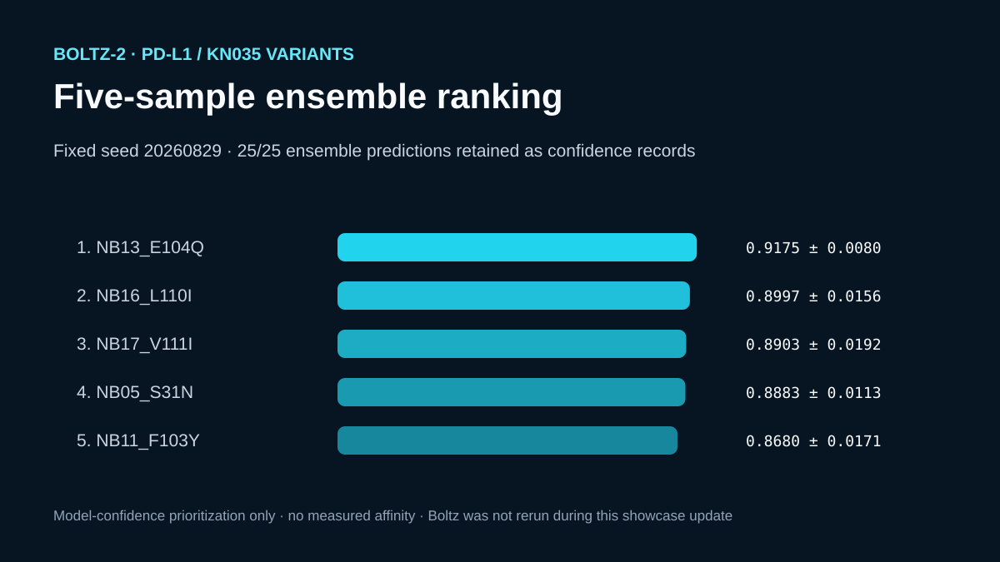

# Codex showcase lesson: Boltz repeated-sampling receipt

## Session prompt

Use $showcase-teacher to import and teach the ready showcase `rosalind-boltz-repeats` (Boltz repeated-sampling receipt). Inspect its README, manifest, prompt, inputs, outputs, previews, and provenance records. Clearly distinguish source observations, computed results, scientific interpretation, and limitations, and show the preview when useful.

## Catalogue record

- Showcase ID: `rosalind-boltz-repeats`
- Plugin: `rosalind-workbench` (Rosalind Workbench v0.2.2-research-preview)
- Status: `ready`
- Domain: `scientific-computing`
- Case type: `analysis`
- Difficulty: `advanced`
- Evidence level: `computed-result`
- Covered operations: `rosalind.rosalind_open`
- Rosalind tasks: none recorded
- Actual tools: `Boltz-2 in a completed local GPU run`, `local Python evidence inspection and compact export`, `Rosalind Workbench mcp__rosalind__rosalind_open`
- Summary: How should fixed inputs, seeds, and ranking criteria be recorded across repeated structure predictions?
- Recorded next step: Audit the fixed inputs, seeds, and rankings for the five-by-five retained Boltz-2 repeat set before any rerun.
- Plugin guide: `showcases/rosalind-workbench/README.md`

## Repository files to inspect

- case guide: `showcases/rosalind-workbench/cases/rosalind-boltz-repeats/README.md`
- case manifest: `showcases/rosalind-workbench/cases/rosalind-boltz-repeats/showcase.json`
- teaching prompt: `showcases/rosalind-workbench/cases/rosalind-boltz-repeats/prompt.md`
- input: `showcases/rosalind-workbench/cases/rosalind-boltz-repeats/build_case.py`
- input: `showcases/rosalind-workbench/cases/rosalind-boltz-repeats/inputs/candidates.csv`
- input: `showcases/rosalind-workbench/cases/rosalind-boltz-repeats/inputs/source-and-run-provenance.md`
- input: `showcases/rosalind-workbench/cases/rosalind-boltz-repeats/inputs/PDL1_Q9NZQ7_18-239.fasta`
- input: `showcases/rosalind-workbench/cases/rosalind-boltz-repeats/prepare_boltz_inputs.py`
- output: `showcases/rosalind-workbench/cases/rosalind-boltz-repeats/outputs/run-evidence.json`
- output: `showcases/rosalind-workbench/cases/rosalind-boltz-repeats/outputs/run-top5-ensemble.sh`
- output: `showcases/rosalind-workbench/cases/rosalind-boltz-repeats/outputs/score-top5-ensemble.py`
- output: `showcases/rosalind-workbench/cases/rosalind-boltz-repeats/outputs/top5-confidence-records.json`
- output: `showcases/rosalind-workbench/cases/rosalind-boltz-repeats/outputs/top5-ensemble-details.json`
- output: `showcases/rosalind-workbench/cases/rosalind-boltz-repeats/outputs/top5-ensemble-ranking.csv`
- output: `showcases/rosalind-workbench/cases/rosalind-boltz-repeats/outputs/rosalind-open-observation.json`
- output: `showcases/rosalind-workbench/cases/rosalind-boltz-repeats/outputs/teaching-bundle.md`
- preview: `showcases/rosalind-workbench/cases/rosalind-boltz-repeats/previews/preview.svg`

## Public sources

- https://github.com/jwohlwend/boltz
- https://www.rcsb.org/structure/5JDS
- https://www.uniprot.org/uniprotkb/Q9NZQ7/entry

## Retained case guide

# Boltz-2 repeated sampling for PD-L1 nanobody candidates

## Scientific question

How stable is the model-based ranking of five KN035-derived PD-L1 nanobody candidates across five fixed-seed Boltz-2 diffusion samples per candidate?

## Public inputs and retained execution

The target is human PD-L1 (UniProt Q9NZQ7, residues 18–239), and the parent complex is PDB 5JDS. `inputs/PDL1_Q9NZQ7_18-239.fasta` retains the target sequence, while `inputs/candidates.csv` contains the tag-free KN035 parent and 19 interface variants. `inputs/source-and-run-provenance.md` records the public acquisition URLs and the historical execution status.

The historical result came from a completed local Boltz-2 GPU run. This case update did not rerun the model. During case preparation, the following items were inspected:

- the exact five-sample command with seed `20260829`;
- the scoring implementation and reference epitope/paratope sets;
- 25 raw confidence payloads and 25 paired structure files in the source run;
- the full per-model metric table and final five-candidate ranking.

## Computed result

The retained ensemble places `NB13_E104Q` first with mean composite score 0.9175 and standard deviation 0.0080. The remaining order is `NB16_L110I`, `NB17_V111I`, `NB05_S31N`, and `NB11_F103Y`. `outputs/top5-ensemble-details.json` gives each model's protein ipTM, interface pLDDT, interface predicted distance error, epitope and paratope recall, minimum interchain distance, and composite score.

## Rosalind Workbench observation

A genuine `mcp__rosalind__rosalind_open` call with the retained Boltz-evidence context returned `Rosalind Workbench is ready. Choose a research task in the app.` with `ready=true`. `outputs/rosalind-open-observation.json` preserves the exact arguments and timestamps.

That call opened only the task chooser. The scientific result comes from the previously verified Boltz-2 execution and the retained local evidence inspection; the launcher call submitted no sequences and performed no prediction or resampling.

## Interpretation

The repeated samples assess model consistency under one input specification and one fixed seed. They support experimental prioritization. The scores are constructed from model confidence and structure-derived contact metrics; they are not binding free energies, dissociation constants, expression yields, or safety measurements.

## Limitations

- Boltz-2 predictions are computational hypotheses.
- The compact repository snapshot omits the historical CIF coordinates; a fresh run recreates all 25 structures from the retained public sequences and command.
- A fixed seed aids repeatability but does not characterize all possible model uncertainty.
- The candidate panel is a local exploration around KN035, not an exhaustive nanobody design campaign.
- The exact Boltz package version used for the historical snapshot was not retained, so a fresh run may differ after model or dependency updates.

## Complete rerun

1. Create a fresh Python environment and install the free open-source packages: `python -m pip install --upgrade "boltz[cuda]" gemmi`. On CPU-only hardware, install `boltz` without the CUDA extra; prediction will be substantially slower.
2. Record `python -m pip show boltz gemmi` and `boltz predict --help` with the new run.
3. Generate the historical top-five YAML inputs: `python prepare_boltz_inputs.py --output-dir rerun/top5-inputs --select NB13_E104Q,NB16_L110I,NB17_V111I,NB05_S31N,NB11_F103Y`.
4. Run the retained fixed-seed command: `bash outputs/run-top5-ensemble.sh rerun/top5-inputs rerun/top5-predictions 20260829`.
5. Score all 25 predictions: `python outputs/score-top5-ensemble.py --candidates inputs/candidates.csv --predictions rerun/top5-predictions --output-dir rerun/top5-ranking`.
6. Compare the fresh CSV and JSON with `outputs/top5-ensemble-ranking.csv` and `outputs/top5-ensemble-details.json`; investigate differences as model, dependency, MSA, hardware, or stochastic drift.
7. Read `outputs/rosalind-open-observation.json` as a launcher record independent of the retained prediction evidence.

## Retained execution prompt

# Boltz-2 repeated-sampling evidence

Inspect the retained PD-L1/KN035 Boltz-2 result snapshot, including 20 candidate sequences, the fixed-seed five-sample ranking, per-model metrics, raw confidence payloads, portable command, scoring method, and historical file-inspection record. For a fresh run, generate YAML inputs from the public sequences and record current package versions. Do not describe model confidence as measured affinity. Inspect `outputs/rosalind-open-observation.json` as the genuine launcher-readiness record; it did not submit sequences or run the model.

## Teaching note

Use this bundle to locate the evidence. Read the listed repository artifacts before presenting scientific claims, and keep observations, calculations, interpretation, and limitations distinct.
