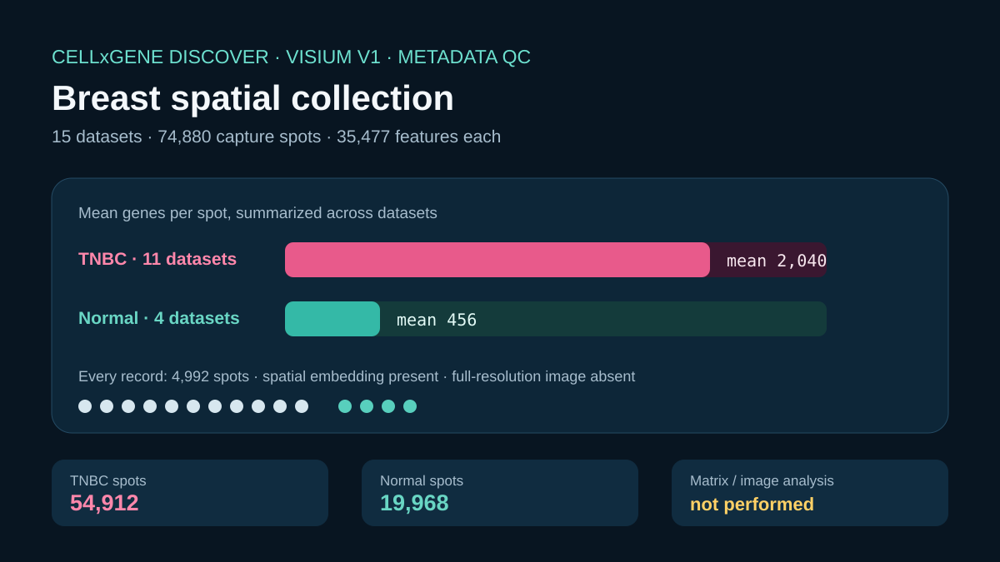

# Codex showcase lesson: Breast cancer Visium workflow

## Session prompt

Use $showcase-teacher to import and teach the ready showcase `rosalind-breast-visium` (Breast cancer Visium workflow). Inspect its README, manifest, prompt, inputs, outputs, previews, and provenance records. Clearly distinguish source observations, computed results, scientific interpretation, and limitations, and show the preview when useful.

## Catalogue record

- Showcase ID: `rosalind-breast-visium`
- Plugin: `rosalind-workbench` (Rosalind Workbench v0.2.2-research-preview)
- Status: `ready`
- Domain: `genomics-and-pathology`
- Case type: `workflow`
- Difficulty: `advanced`
- Evidence level: `multi-tool-result`
- Covered operations: `rosalind-workbench.public-evidence`, `rosalind.rosalind_open`
- Rosalind tasks: `compare-pathology-visium`
- Actual tools: `Rosalind Workbench mcp__rosalind__rosalind_open`, `CZ CELLxGENE Discover API via cellxgene-skill and local Python standard library`
- Summary: How can a public Visium dataset support spatial QC and region-aware exploration?
- Recorded next step: Repeat quality checks across the 15 retained breast-cancer Visium metadata records before planning region-aware exploration.
- Plugin guide: `showcases/rosalind-workbench/README.md`

## Repository files to inspect

- case guide: `showcases/rosalind-workbench/cases/rosalind-breast-visium/README.md`
- case manifest: `showcases/rosalind-workbench/cases/rosalind-breast-visium/showcase.json`
- teaching prompt: `showcases/rosalind-workbench/cases/rosalind-breast-visium/prompt.md`
- input: `showcases/rosalind-workbench/cases/rosalind-breast-visium/build_case.py`
- input: `showcases/rosalind-workbench/cases/rosalind-breast-visium/inputs/public-source.md`
- input: `showcases/rosalind-workbench/cases/rosalind-breast-visium/inputs/cellxgene-collection.json`
- output: `showcases/rosalind-workbench/cases/rosalind-breast-visium/outputs/visium-metadata-summary.json`
- output: `showcases/rosalind-workbench/cases/rosalind-breast-visium/outputs/dataset-qc-table.csv`
- output: `showcases/rosalind-workbench/cases/rosalind-breast-visium/outputs/provenance.json`
- output: `showcases/rosalind-workbench/cases/rosalind-breast-visium/outputs/rosalind-open-observation.json`
- output: `showcases/rosalind-workbench/cases/rosalind-breast-visium/bundle.md`
- preview: `showcases/rosalind-workbench/cases/rosalind-breast-visium/previews/preview.svg`

## Public sources

- https://cellxgene.cziscience.com/collections/bfd55632-15e2-4dde-a1b9-02ade511fc4d
- https://doi.org/10.1016/j.labinv.2023.100258

## Retained case guide

# Breast-cancer Visium metadata QC



## Scientific question

What study-level QC facts can be reproduced from a public breast-cancer Visium collection before downloading expression matrices and images?

## Public collection

The retained CELLxGENE Discover response describes collection `bfd55632-15e2-4dde-a1b9-02ade511fc4d`, *Spatial Transcriptomics Reveal Pitfalls and Opportunities for the Detection of Rare High-Plasticity Breast Cancer Subtypes* (DOI `10.1016/j.labinv.2023.100258`). It was retrieved through the official collection API at `2026-08-29T18:22:33.632996Z` using the repository's CELLxGENE skill.

All 15 datasets are human breast Visium Spatial Gene Expression V1 records (`EFO:0022857`), each with 4,992 capture spots, 35,477 features, and a spatial embedding. The retained metadata reports no full-resolution image asset.

## Executed deterministic analysis

`build_case.py` validates every assay and spatial field, groups the datasets by disease label, and writes one row per dataset to `outputs/dataset-qc-table.csv`.

- Total: 15 datasets and 74,880 capture spots.
- Triple-negative breast carcinoma: 11 datasets, 54,912 spots; per-dataset mean genes per spot range 855.216947–4,132.877404 and median 1,775.067107.
- Normal breast: 4 datasets, 19,968 spots; range 226.162260–673.256611 and median 462.976062.
- The `malignant cell` label occurs in all 11 carcinoma dataset inventories and none of the four normal inventories.

These values are collection metadata summaries. A biological comparison requires spot-level matrices, tissue images, appropriate normalization, spatial coordinates, pathology review, and a study design that addresses participant and technical effects.

## Data-use note

The retained input is a public-metadata extract with all study participant pseudonyms removed. It preserves only an aggregate summary: 11 participants contributed 15 datasets, and three participants contributed more than one dataset. This is enough to warn against treating every dataset as independent without publishing participant labels.

## Observed Rosalind Workbench invocation

`mcp__rosalind__rosalind_open` was genuinely invoked at `2026-08-29T18:20:56.361Z`. It returned exactly `Rosalind Workbench is ready. Choose a research task in the app.` with `ready=true`. The 898-byte `outputs/rosalind-open-observation.json` retains the case-specific arguments, timestamps, response, and `scientific_job_executed=false`.

The launcher call did not receive a Visium matrix or image. CELLxGENE metadata and the local script support the QC summary.

## Limitations

- The retained response contains dataset-level metadata, not expression values, spot coordinates, or image pixels.
- `mean_genes_per_cell` is a CELLxGENE metadata field; for Visium records it is interpreted here as a per-capture-spot summary.
- The public collection can be revised, so a fresh analysis should preserve the new collection-version identifier.
- The de-identified extract cannot reconstruct which datasets came from the same participant; a fresh participant-aware analysis must retrieve the official source under an appropriate data-use procedure.
- No Rosalind spatial analysis, pathology annotation, or wet-lab work was executed.

## Reproduce

```powershell
python showcases/rosalind-workbench/cases/rosalind-breast-visium/build_case.py
python scripts/showcase_session.py bundle rosalind-breast-visium --output showcases/rosalind-workbench/cases/rosalind-breast-visium/bundle.md
```

## Retained execution prompt

# Breast-cancer Visium metadata QC

Use the retained official CELLxGENE collection response for `bfd55632-15e2-4dde-a1b9-02ade511fc4d`. Verify the 15 Visium records, spatial-embedding status, capture-spot and feature counts, disease groups, per-dataset mean-genes-per-spot distributions, and broad label inventories. Do not infer expression, morphology, or region biology from metadata alone. Invoke `mcp__rosalind__rosalind_open` only to open the task chooser; cite the exact 898-byte `outputs/rosalind-open-observation.json` and state that no spatial dataset was submitted to Rosalind.

## Teaching note

Use this bundle to locate the evidence. Read the listed repository artifacts before presenting scientific claims, and keep observations, calculations, interpretation, and limitations distinct.
