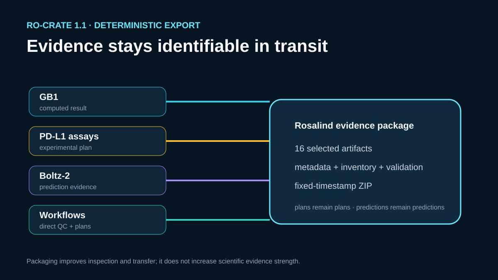

# Cross-case Rosalind evidence export

## Scientific question

Can selected evidence from four different Rosalind teaching cases be packaged for inspection and transfer while keeping public observations, computed results, experimental plans, workflow plans, and provenance distinguishable?

## Exported research object

`build_case.py` creates a self-contained RO-Crate directory and deterministic ZIP. The package includes selected evidence from:

- the 500-variant GB1 categorical embedding;
- the PD-L1 assay and plate plan;
- the retained Boltz-2 ensemble evidence;
- the direct FASTQ QC result and two unexecuted workflow definitions.

`outputs/ro-crate/artifact-inventory.csv` records the source case, source path, evidence class, and byte count for every copied artifact. `ro-crate-metadata.json` describes the same files as JSON-LD entities. `validation.json` checks file presence, content-size declarations, and preservation of plan labels.

## Verified result

The archive is written with sorted member paths and a fixed timestamp. Repeating the builder against unchanged source artifacts produces the same member order and contents. The package contains no missing planned engine output and no invented wet-lab result.

## Rosalind Workbench observation

A genuine `mcp__rosalind__rosalind_open` call with the cross-tool export context returned `Rosalind Workbench is ready. Choose a research task in the app.` with `ready=true`. `outputs/rosalind-open-observation.json` records its exact arguments and timestamps.

The launcher call did not copy files, build the RO-Crate, create the ZIP, or validate its members. Those results came from the local deterministic builder and remain documented in the inventory, metadata, validation report, and archive.

## Interpretation

The package makes heterogeneous evidence easier to inspect and transfer. Its classifications help a reader distinguish source observations, local calculations, model predictions, and proposed experiments.

## Limitations

- Packaging does not strengthen the biological evidence in any source case.
- External source URLs can change after the recorded access date.
- The selected artifact set is compact; large Boltz structure coordinates and the full ProteinGym archive are referenced through provenance rather than copied.
- RO-Crate structural validation does not establish that a scientific method or interpretation is correct.

## Reproduce

1. Verify the four source case directories and their retained artifacts.
2. Run `python build_case.py`.
3. Inspect `outputs/ro-crate/validation.json` and `artifact-inventory.csv`.
4. Extract `outputs/rosalind-evidence-ro-crate.zip` into an empty directory and compare the member list with the RO-Crate directory.
5. Inspect `outputs/rosalind-open-observation.json` separately from the export products.
