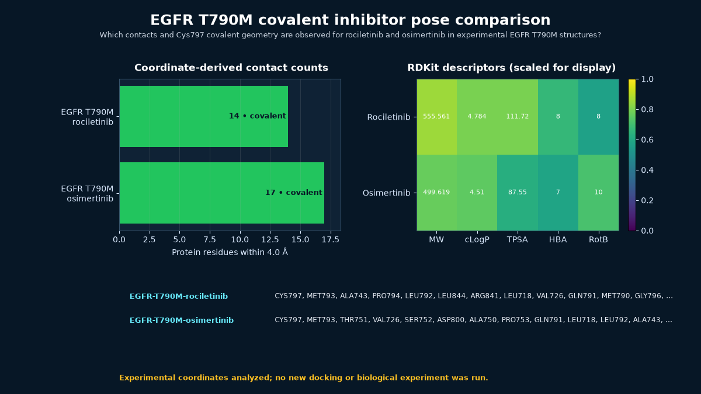

# EGFR T790M covalent inhibitor pose comparison



## Scientific question

Which contacts and Cys797 covalent geometry are observed for rociletinib and osimertinib in experimental EGFR T790M structures?

## Source observations

- PDB 5XDK is a 2.346 Å X-ray structure of EGFR residues 696–1022 carrying T790M with CO-1686/rociletinib (entry revision 1.2).
- PDB 6JX0 is a 2.53 Å X-ray structure of the same EGFR region carrying T790M with AZD9291/osimertinib (entry revision 1.3).
- Each PDB file has an explicit covalent `LINK` between Cys797 SG and the inhibitor: 1.83 Å for rociletinib and 1.80 Å for osimertinib.
- PubChem CIDs 57335384 and 71496458 provide the retained compound records.
- No official Rosalind task ID exactly describes this comparison, so the task array is empty. The case records only the current Workbench launcher capability, `rosalind.rosalind_open`.

## Rosalind Workbench observation

At `2026-08-29T17:56:33.562Z`, the genuine `mcp__rosalind__rosalind_open` call used the task context "Document the EGFR T790M inhibitor-pose showcase; open the task chooser only and do not start a scientific job." The exact response was "Rosalind Workbench is ready. Choose a research task in the app." The returned `ready=true` value refers to the launcher; no docking, inhibitor analysis, or other scientific job was executed. The retained record is [`outputs/rosalind-open-observation.json`](outputs/rosalind-open-observation.json). All contact and descriptor evidence comes from public records and local computation.

## Local computation

Using a 4.0 Å minimum heavy-atom cutoff, the script found 14 EGFR contact residues for rociletinib and 17 for osimertinib. Twelve exact residue labels are shared (Jaccard 0.6316): Ala743, Arg841, Asp800, Cys797, Gln791, Gly796, Leu718, Leu792, Leu844, Met793, Pro794, and Val726.

RDKit recomputation gives molecular weights of 555.561 and 499.619, topological polar surface areas of 111.72 and 87.55 Ų, and 8 and 10 rotatable bonds for rociletinib and osimertinib, respectively.

## Interpretation

Both deposited inhibitors share a core ATP-site contact environment and the Cys797 covalent attachment, while their peripheral contact inventories and descriptor profiles differ. The geometry is suitable for comparing experimentally resolved poses; it cannot by itself explain mutant selectivity, resistance, exposure, or efficacy.

## Limitations

- No docking, covalent reaction simulation, kinase assay, cellular assay, resistance experiment, or clinical analysis was run.
- T790M appears in both constructs, so this two-structure comparison does not quantify mutant-versus-wild-type selectivity.
- The 4.0 Å table does not assign bond energetics, water-mediated contacts, protonation states, or dynamic ensembles.
- PDB revisions and crystallographic conditions are recorded because they can affect a close-contact inventory.

## Reproduce

```powershell
python scripts/analyze_case.py
```

To refresh the public records first:

```powershell
python scripts/fetch_public_inputs.py
python scripts/analyze_case.py
```

Check `outputs/analysis-summary.json` for the retained `LINK` records and `outputs/contacts.csv` for the nearest atom pairs.

To repeat the Workbench observation, call `mcp__rosalind__rosalind_open` with the recorded EGFR task context and save the exact response separately. The chooser action is not a scientific EGFR run.
