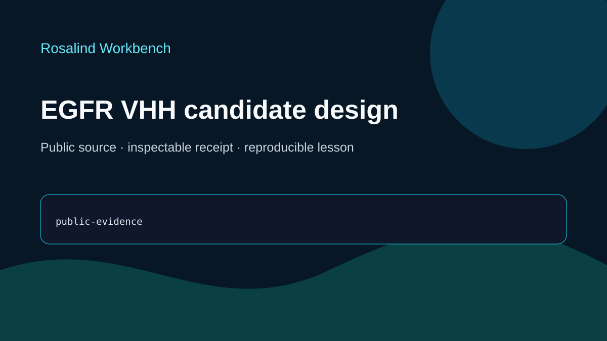

# EGFR VHH candidate design

This ready teaching case uses an existing experimental EGFR–VHH structure. It documents public evidence and reproducibility without generating a new candidate.

## Scientific question

Which public EGFR structural features support a compact VHH design exercise?

## Source observations

- RCSB PDB 4KRL is an X-ray structure of nanobody/VHH 7D12 bound to domain III of the human EGFR extracellular region.
- The record reports 2.85 Å resolution and a heterodimeric assembly containing one VHH chain and one EGFR chain.
- The retained evidence describes a published complex. No new VHH sequence, docking pose, optimization, or ranking is present in this case.

The dated, case-specific source summary is stored in `outputs/verification-receipt.json`; acquisition details are in `inputs/public-source.md`.

## Rosalind Workbench observation

One genuine `mcp__rosalind__rosalind_open` call was made with this case's task context at `2026-08-29T18:23:14.117Z`. It returned `Rosalind Workbench is ready. Choose a research task in the app.` with `ready=true`. Exact arguments, UTC and local timestamps, and `scientific_job_executed=false` are retained in `outputs/rosalind-open-observation.json` and cited by `outputs/provenance.json`.

The launcher observation establishes only that the task chooser was ready. It does not establish a scientific run and did not analyze the 4KRL interface or generate a VHH candidate.

## Interpretation

PDB 4KRL offers a concrete example for discussing how an experimentally observed EGFR–VHH pose can inform later research questions. Any future residue-level interface analysis or design claim needs its own computation and validation record.

## Reproduce

1. Read `prompt.md` and `inputs/public-source.md`.
2. Inspect the current RCSB PDB 4KRL record and compare it with `outputs/verification-receipt.json`.
3. Verify `outputs/rosalind-open-observation.json` separately from the structural evidence.
4. Use `outputs/session-bundle.md` as the teaching index and review the preview.

## Limitations

- No coordinate analysis, docking, sequence creation, optimization, or ranking was performed.
- The source record may change after the recorded date.
- Experimental structure evidence for 7D12 does not validate a new VHH candidate.
