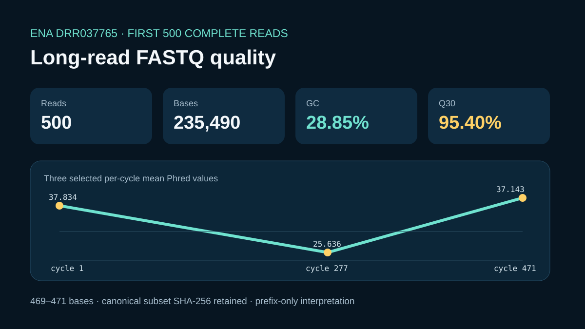

# Deterministic FASTQ quality summary



## Scientific question

Which sequence and base-quality metrics are reproducible from the first 500 complete reads of public ENA run `DRR037765`?

## Public source and subset rule

The case retains the 127,526-byte ENA gzip object with MD5 `81735432a6f578b332aae58cdbd95231`. `build_case.py` validates the compressed source, reads the first 500 complete FASTQ records, checks sequence/quality length equality, retains the first header token, normalizes the plus line to `+`, and uses LF endings for the canonical in-memory subset.

## Executed deterministic analysis

- 500 reads and 235,490 bases
- read lengths 469–471 bases; mean 470.98 bases
- 28.846236% GC
- 95.397681% of bases at Q30 or greater
- canonical subset: 480,372 bytes, SHA-256 `46bd72991d9c9c2bf64751e88e52548d852d5fa021da4815ee6f6517a51b18b9`

`outputs/per-cycle-quality.csv` contains all 471 cycle summaries. Cycle 1 has mean Phred 37.834 and 99.4% Q30; the lowest mean occurs at cycle 277 (25.636, 35.6% Q30); cycle 471 includes 491 reads and has mean Phred 37.142566.

These metrics describe the deterministic subset only. They do not establish the quality of the complete run or its suitability for a specific downstream assay.

## Observed Rosalind Workbench invocation

`mcp__rosalind__rosalind_open` was genuinely invoked at `2026-08-29T18:21:00.272Z`. It returned exactly `Rosalind Workbench is ready. Choose a research task in the app.` with `ready=true`. The 894-byte `outputs/rosalind-open-observation.json` retains the case-specific arguments, timestamps, response, and `scientific_job_executed=false`.

The launcher call did not receive the reads. The retained ENA object and local Python script produced the QC outputs.

## Limitations

- A 500-read prefix can differ from the full-run quality distribution.
- No adapter, contamination, taxonomic, duplication, or assay-specific assessment was performed.
- Phred+33 is used for the retained quality strings.
- No Rosalind FASTQ analysis or wet-lab work was executed.

## Reproduce

```powershell
python showcases/rosalind-workbench/cases/rosalind-fastq-qc/build_case.py
python scripts/showcase_session.py bundle rosalind-fastq-qc --output showcases/rosalind-workbench/cases/rosalind-fastq-qc/bundle.md
```
