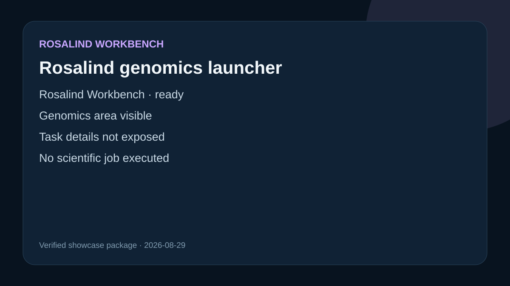

# Rosalind genomics launcher

## Observed interface state

Rosalind Workbench returned schema `life-sciences.launcher/v1`, reported `ready: true`, and displayed its launcher. The visible scientific areas included molecular design, structure analysis, genomics, and scientific compute.

## What this showcase establishes

The current Codex environment can open the Rosalind research launcher and present this scientific area as a task category.

## Limitation

The tool response did not expose the underlying task list, task descriptions, or a resulting workspace. No scientific job was selected or executed. The preview records the observed launcher state only.
