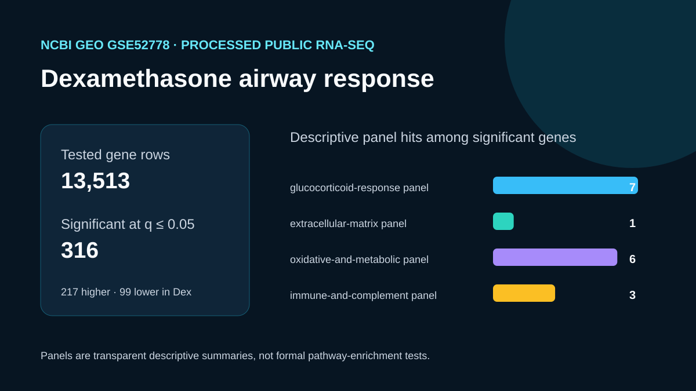

# Dexamethasone airway RNA-seq

## Scientific question

Which genes and pathways change in a small public dexamethasone airway RNA-seq study?

## Public source and computation

GEO series GSE52778 contains 16 airway smooth-muscle RNA-seq samples from four donors and four treatment conditions. `build_case.py` downloads the authors' processed `Dex_vs_Untreated_gene_exp.diff.gz` table, retains it unchanged, filters status `OK` rows at q ≤ 0.05, and recomputes direction as log2(Dex FPKM / untreated FPKM).

## Computed result

- 23,273 source rows; 13,513 status-OK gene rows.
- 316 significant rows at q ≤ 0.05: 217 higher and 99 lower in dexamethasone by the recomputed direction.
- The leading retained genes include SPARCL1, KLF15, FKBP5, SAMHD1, GPX3, C7, SERPINA3, MAOA, DUSP1, and CCDC69.
- `outputs/theme-panel-summary.csv` reports transparent overlap with four small predeclared panels. These counts are descriptive and have no enrichment p-values.

## Interpretation

The processed comparison shows a strong dexamethasone-associated transcriptional response, including established glucocorticoid-responsive genes such as FKBP5, TSC22D3, KLF15, DUSP1, PER1, KLF9, and CRISPLD2. The panel summaries help organize follow-up questions; they do not establish pathway enrichment.

## Rosalind observation

`outputs/rosalind-open-observation.json` records one genuine `mcp__rosalind__rosalind_open` call with genomics context. It confirmed launcher readiness and records `scientific_job_executed: false`. All numerical results were computed locally from the retained public GEO table.

## Limitations

- This is the authors' processed Cuffdiff comparison, not a reanalysis from raw reads or counts.
- FPKM and Cuffdiff reflect the study's original hg19-era pipeline; modern count-based reanalysis may differ.
- The four theme panels are small, predeclared teaching sets and do not support formal pathway-level claims.
- Four donors limit generalization; donor pairing and other design terms are not re-estimated here.

## Reproduce

1. Run `python build_case.py` from this case directory.
2. Confirm 23,273 source rows, 13,513 status-OK rows, and 316 q ≤ 0.05 rows.
3. Inspect the top-gene and theme-panel CSV files plus `outputs/analysis-summary.json`.
4. Read `outputs/rosalind-open-observation.json` separately as launcher evidence.
