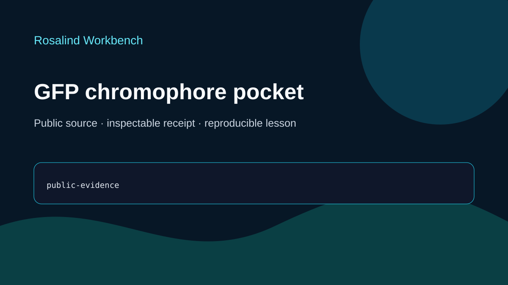

# GFP chromophore pocket

This ready teaching case records public structural context for the GFP chromophore and explains what a reproducible pocket query would need. It does not alter a sequence or calculate a pocket.

## Scientific question

Which residues form the local environment of the mature GFP chromophore?

## Source observations

- RCSB PDB 1EMA is a 1.90 Å X-ray structure of an *Aequorea victoria* GFP variant.
- The linked primary report describes an 11-stranded beta barrel with a coaxial helix, chromophore formation from residues 65–67, and Thr203 adjacent to the chromophore.
- The retained case contains no coordinate-derived contact list or distance cutoff. It therefore does not define the complete chromophore pocket.

The dated, case-specific source summary is stored in `outputs/verification-receipt.json`; acquisition details are in `inputs/public-source.md`.

## Rosalind Workbench observation

One genuine `mcp__rosalind__rosalind_open` call was made with this case's task context at `2026-08-29T18:23:14.204Z`. It returned `Rosalind Workbench is ready. Choose a research task in the app.` with `ready=true`. Exact arguments, UTC and local timestamps, and `scientific_job_executed=false` are retained in `outputs/rosalind-open-observation.json` and cited by `outputs/provenance.json`.

The launcher observation establishes only that the task chooser was ready. It does not establish a scientific run and did not retrieve coordinates, calculate a pocket, alter a sequence, or predict fluorescence.

## Interpretation

PDB 1EMA is a strong teaching reference for planning a transparent pocket query. A computed residue list would need an explicit chromophore representation, chain and residue mapping, atom-selection rule, distance cutoff, and retained output.

## Reproduce

1. Read `prompt.md` and `inputs/public-source.md`.
2. Inspect the current RCSB PDB 1EMA record and compare it with `outputs/verification-receipt.json`.
3. Verify `outputs/rosalind-open-observation.json` separately from the structural evidence.
4. Use `outputs/session-bundle.md` as the teaching index and review the preview.

## Limitations

- No coordinate query or complete pocket residue list is retained.
- No sequence change, structural optimization, or fluorescence prediction was produced.
- The source record may change after the recorded date.
