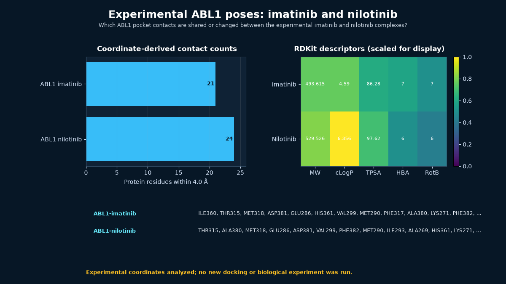

# Experimental ABL1 poses: imatinib and nilotinib



## Scientific question

Which ABL1 pocket contacts are shared or changed between the experimental imatinib and nilotinib complexes?

## Source observations

- PDB 1IEP is a 2.10 Å X-ray structure of the ABL kinase domain with STI-571 (imatinib); the retained RCSB record is entry revision 1.3.
- PDB 3CS9 is a 2.21 Å X-ray structure of ABL1 with nilotinib; the retained RCSB record is entry revision 1.3.
- PubChem CIDs 5291 and 644241 provide named compound records for imatinib and nilotinib.
- The installed Rosalind catalogue exposes `rosalind.rosalind_open` as the current Workbench launcher capability.

## Rosalind Workbench observation

At `2026-08-29T17:56:33.507Z`, the genuine `mcp__rosalind__rosalind_open` call used the case-specific task context "Document the Imatinib-ABL1 experimental-pose showcase; open the task chooser only and do not start a scientific job." The observed response was exactly "Rosalind Workbench is ready. Choose a research task in the app." The response records `ready=true`, but the operation only opened the task chooser and did not execute a scientific job. The complete call observation is retained in [`outputs/rosalind-open-observation.json`](outputs/rosalind-open-observation.json); all scientific results below come from the retained public coordinates and local computations.

## Local computation

The retained Python script reads each deposited pose, measures every ligand-to-protein heavy-atom distance, and reports a residue as a contact when the minimum distance is at most 4.0 Å. RDKit independently recomputes molecular weight, cLogP, topological polar surface area, hydrogen-bond counts, and rotatable bonds from the PubChem CID records.

The analysis found 21 ABL1 contact residues for imatinib and 24 for nilotinib. Nineteen residue labels were shared, giving a contact-set Jaccard value of 0.7308. The shared set includes Thr315, Met318, Glu286, Asp381, and Phe382. The complete atom-level nearest-distance table is retained in `outputs/contacts.csv`.

## Interpretation

The two deposited inhibitors occupy a strongly overlapping ABL1 pocket while retaining distinct peripheral contacts. That comparison is useful for teaching pose inspection and contact-table reading. It does not provide a docking score, affinity estimate, resistance prediction, or treatment conclusion.

## Limitations

- No new docking was run; both ligand conformations are experimental deposited poses.
- A 4.0 Å distance inventory is geometric and does not assign hydrogen-bond energetics, water mediation, protonation, or conformational free energy.
- The complexes use specific crystallographic constructs and conditions; contact differences cannot be attributed to ligand chemistry alone.
- RDKit cLogP and PubChem XLogP are method-dependent estimates and are retained in separate columns.

## Reproduce

From this case directory:

```powershell
python scripts/analyze_case.py
```

This recomputes all outputs and both previews from the retained public inputs. To retrieve the current RCSB revisions and the same fixed PubChem CIDs first, run:

```powershell
python scripts/fetch_public_inputs.py
python scripts/analyze_case.py
```

Inspect `inputs/source-metadata.json`, `outputs/analysis-summary.json`, `outputs/contacts.csv`, `outputs/contact-overlap.csv`, and `outputs/descriptors.csv` before quoting a value.

To repeat the Workbench readiness observation, call `mcp__rosalind__rosalind_open` with the task context recorded above and save the observed response separately. This launcher action does not replace `python scripts/analyze_case.py` and does not demonstrate docking or another scientific job.
