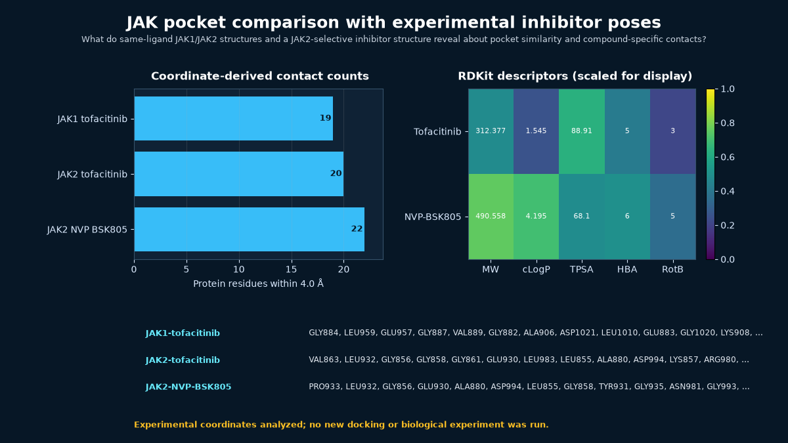

# JAK pocket comparison with experimental inhibitor poses



## Scientific question

What do same-ligand JAK1/JAK2 structures and a JAK2-selective inhibitor structure reveal about pocket similarity and compound-specific contacts?

## Source observations

- PDB 3EYG (1.90 Å) and 3FUP (2.40 Å) contain the same ligand, MI1/tofacitinib, bound to JAK1 and JAK2. Their common primary study was designed to compare Janus-kinase specificity.
- PDB 3KRR (1.80 Å) contains the quinoxaline inhibitor DQX/NVP-BSK805 bound to JAK2. Its primary report describes greater than 20-fold biochemical selectivity for JAK2 within the JAK family; that published measurement is source evidence, not a result of this local calculation.
- PubChem CIDs 9926791 and 46398810 provide the retained tofacitinib and NVP-BSK805 records.
- `design-jak2-binders` is the semantically matching official Rosalind task ID. The current callable Workbench capability is `rosalind.rosalind_open`.

## Rosalind Workbench observation

At `2026-08-29T17:56:33.525Z`, the genuine `mcp__rosalind__rosalind_open` call used the task context "Document the JAK2 selectivity showcase; open the task chooser only and do not start a scientific job." The exact response was "Rosalind Workbench is ready. Choose a research task in the app." It records `ready=true`; the operation opened only the chooser and did not execute binder design, docking, or another scientific job. See [`outputs/rosalind-open-observation.json`](outputs/rosalind-open-observation.json). The contact, alignment, and descriptor results remain products of the retained public data and deterministic local computation.

## Local computation

The coordinate analysis uses a 4.0 Å minimum heavy-atom cutoff and a deterministic Needleman–Wunsch alignment to compare homologous pocket positions when JAK1 and JAK2 residue numbers differ.

- JAK1–tofacitinib: 19 contacting residues.
- JAK2–tofacitinib: 20 contacting residues.
- Eighteen homolog-mapped contact positions are shared by the same-ligand JAK1/JAK2 pair (Jaccard 0.8571).
- JAK2–NVP-BSK805: 22 contacting residues; 17 exact JAK2 residue labels overlap the JAK2–tofacitinib contact set (Jaccard 0.6800).

RDKit descriptor rows show that the two compounds differ substantially in size and lipophilicity: recomputed molecular weights are 312.377 and 490.558, and cLogP values are 1.545 and 4.195, respectively.

## Interpretation

The same-ligand structures demonstrate a highly conserved ATP-site contact environment across JAK1 and JAK2. The larger NVP-BSK805 pose adds compound-specific contacts within JAK2, but the coordinate inventory alone cannot explain or predict biochemical selectivity. A defensible JAK2 design exercise therefore needs matched isoform assays and more than a static contact count.

## Limitations

- No ligand design, docking, free-energy calculation, kinase assay, or cellular experiment was run.
- The simple sequence alignment identifies homologous positions but does not perform a structural superposition.
- Contact presence does not encode interaction strength; apparent differences can also reflect crystal construct, resolution, side-chain state, or missing solvent.
- Published selectivity belongs to the cited 3KRR study and is not recomputed here.

## Reproduce

```powershell
python scripts/analyze_case.py
```

To refresh public records before analysis:

```powershell
python scripts/fetch_public_inputs.py
python scripts/analyze_case.py
```

Use `outputs/contact-overlap.csv` for the homology-mapped comparison, `outputs/contacts.csv` for residue-level distances, and `outputs/descriptors.csv` for the PubChem/RDKit property table.

To repeat the Workbench observation, call `mcp__rosalind__rosalind_open` with the recorded JAK2 task context and preserve its exact response separately. Launcher readiness is not evidence of a JAK2 scientific run.
