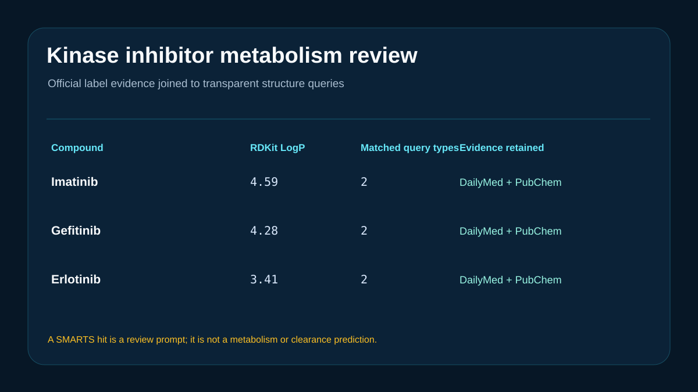

# Kinase inhibitor metabolism-evidence review



## Scientific question

How can exact public structures and official label statements be combined with transparent structural prompts for imatinib, gefitinib, and erlotinib?

## Source observations

- PubChem records identify imatinib as CID 5291, gefitinib as CID 123631, and erlotinib as CID 176870.
- The retained DailyMed label states that CYP3A4 is the major enzyme responsible for imatinib metabolism.
- The gefitinib label describes extensive hepatic metabolism, predominantly by CYP3A4.
- The erlotinib label describes primary CYP3A4 metabolism, with lesser CYP1A2 and CYP1A1 contributions in vitro.

Exact statements and source URLs are retained in `inputs/metabolism-evidence.csv`.

## Computed results

RDKit 2026.03.5 recomputes molecular descriptors and applies five explicit SMARTS queries. Imatinib matches tertiary-amine and benzylic-carbon prompts; gefitinib matches tertiary-amine and aryl-alkyl-ether prompts; erlotinib matches aryl-alkyl-ether and terminal-alkyne prompts. Full zero and nonzero match counts appear in `outputs/structural-alerts.csv`.

## Interpretation

DailyMed statements provide the enzyme-related evidence. The SMARTS hits nominate structural regions for closer examination and comparison with metabolite-identification studies. They do not predict enzyme specificity, intrinsic clearance, metabolite abundance, or clinical interaction magnitude.

## Rosalind Workbench observation

The genuine `mcp__rosalind__rosalind_open` call at `2026-08-29T17:56:31.367Z` returned `Rosalind Workbench is ready. Choose a research task in the app.` with `ready=true`. The case-specific arguments and exact observed response are retained in `outputs/rosalind-open-observation.json`.

This operation only opens the Rosalind task chooser. It does not prove that a metabolism scientific task ran; the public records, official label statements, and deterministic local calculations above provide the scientific evidence in this case.

## Limitations

- The SMARTS set is small, uncalibrated, and can miss relevant chemistry or produce false positives.
- No metabolite prediction, microsomal stability, hepatocyte clearance, transporter, or clinical exposure model was run.
- PubChem and RDKit lipophilicity values are computed molecular descriptors.
- Official labels can be revised after the retrieval date.
- The Workbench chooser was opened, while no Rosalind scientific job was executed.

## Reproduce

```powershell
python showcases/rosalind-workbench/cases/rosalind-kinase-metabolism/scripts/analyze.py
```

Review `outputs/descriptors.csv`, `outputs/structural-alerts.csv`, `outputs/metabolism-review.csv`, `outputs/result-summary.json`, `outputs/rosalind-open-observation.json`, and `previews/preview.svg`.
