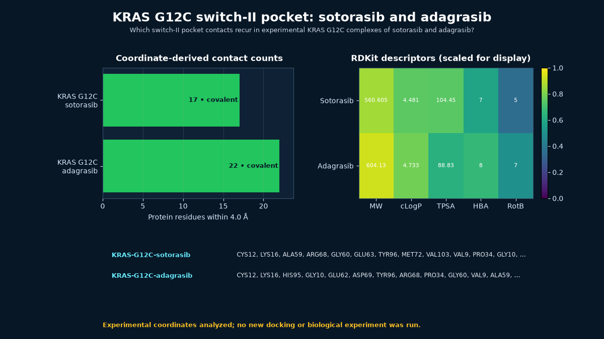

# KRAS G12C switch-II pocket: sotorasib and adagrasib



## Scientific question

Which switch-II pocket contacts recur in experimental KRAS G12C complexes of sotorasib and adagrasib?

## Source observations

- PDB 6OIM is a 1.65 Å X-ray structure of KRAS G12C covalently bound to AMG 510/sotorasib (entry revision 1.4).
- PDB 6USZ is a 2.03 Å X-ray structure from the MRTX849/adagrasib discovery series (entry revision 1.3).
- Both coordinate files contain explicit `LINK` records joining Cys12 SG to the deposited inhibitor: 1.81 Å in 6OIM and 1.69 Å in 6USZ.
- PubChem CIDs 137278711 and 138611145 provide the named sotorasib and adagrasib records.
- No semantically exact official Rosalind task ID exists for this case, so `rosalind_tasks` is empty. `rosalind.rosalind_open` records the current launcher capability only.

## Rosalind Workbench observation

At `2026-08-29T17:56:33.544Z`, the genuine `mcp__rosalind__rosalind_open` call used the task context "Document the KRAS G12C ligand-pose showcase; open the task chooser only and do not start a scientific job." Its exact response was "Rosalind Workbench is ready. Choose a research task in the app." Although the response records `ready=true`, it shows only that the chooser opened; no scientific job ran. The record is [`outputs/rosalind-open-observation.json`](outputs/rosalind-open-observation.json), while the scientific evidence is supplied by the deposited structures, PubChem records, and local analysis.

## Local computation

At a 4.0 Å minimum heavy-atom cutoff, the retained script found 17 protein contact residues for sotorasib and 22 for adagrasib. All 17 residues in the sotorasib contact set also occur in the adagrasib set, producing a Jaccard value of 0.7727. Shared positions include Cys12, His95, Tyr96, Met72, Glu62, Arg68, Gln99, and Val103.

The descriptor table independently recomputed from PubChem structures reports molecular weights of 560.605 and 604.130 and RDKit cLogP values of 4.481 and 4.733 for sotorasib and adagrasib, respectively.

## Interpretation

The two deposited inhibitors occupy a common switch-II pocket environment and share the covalent Cys12 attachment, while the larger adagrasib contact set extends beyond the complete sotorasib contact set at this cutoff. This geometric comparison supports pocket-focused teaching; it does not rank potency, selectivity, reactivity, safety, or clinical performance.

## Limitations

- No new docking, covalent reaction modeling, kinetics, binding assay, cellular assay, or clinical comparison was run.
- PDB `LINK` distances describe the deposited covalent geometry, not reaction rate or warhead selectivity.
- Static contact counts omit solvation, protein dynamics, nucleotide-state ensembles, protonation, and energetic contributions.
- The property table describes parent compound records; a PDB ligand marked as a bound form can differ from the unreacted parent representation.

## Reproduce

```powershell
python scripts/analyze_case.py
```

To refresh RCSB records and the fixed PubChem CIDs:

```powershell
python scripts/fetch_public_inputs.py
python scripts/analyze_case.py
```

The exact atom pairs and distances are in `outputs/contacts.csv`; deposited covalent records are preserved in `outputs/analysis-summary.json`.

To repeat the Workbench observation, call `mcp__rosalind__rosalind_open` with the recorded KRAS task context and preserve its exact response separately. The operation does not perform docking or covalent reaction modeling.
