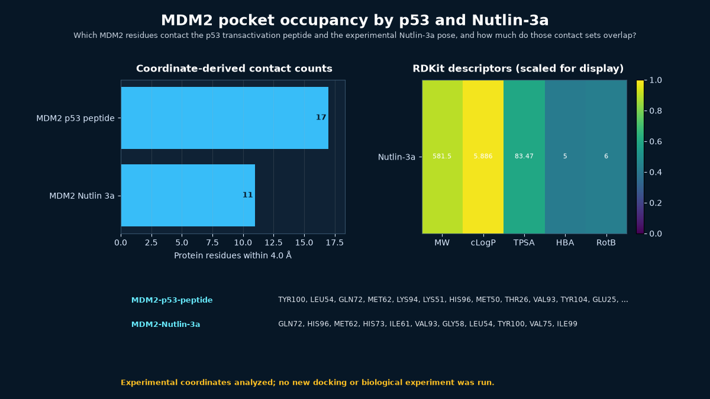

# MDM2 pocket occupancy by p53 and Nutlin-3a



## Scientific question

Which MDM2 residues contact the p53 transactivation peptide and the experimental Nutlin-3a pose, and how much do those contact sets overlap?

## Source observations

- PDB 1YCR is a 2.60 Å X-ray structure of MDM2 bound to a p53 transactivation-domain peptide (entry revision 1.5).
- PDB 4HG7 is a 1.60 Å X-ray structure of an MDM2/Nutlin-3a complex (entry revision 1.2). The MDM2 construct contains engineered surface-entropy-reduction substitutions, which the source record identifies.
- In 1YCR, the nearest p53 residues to several MDM2 contacts include the canonical Phe19 and Trp23 positions; the full nearest-pair inventory is retained in `outputs/contacts.csv`.
- PubChem CID 11433190 supplies the retained Nutlin-3a record.
- No official Rosalind task ID exactly covers MDM2–p53 inhibition, so the task array is empty. `rosalind.rosalind_open` is recorded only as the current Workbench launcher capability.

## Rosalind Workbench observation

At `2026-08-29T17:56:33.580Z`, the genuine `mcp__rosalind__rosalind_open` call used the task context "Document the MDM2-p53 inhibitor showcase; open the task chooser only and do not start a scientific job." Its exact response was "Rosalind Workbench is ready. Choose a research task in the app." The `ready=true` value documents chooser readiness only; it does not show that docking, pocket analysis, or another scientific job ran. See [`outputs/rosalind-open-observation.json`](outputs/rosalind-open-observation.json). Scientific support comes from the retained PDB/PubChem inputs and local calculations.

## Local computation

The 4.0 Å minimum heavy-atom analysis found 17 MDM2 residues contacting the p53 peptide and 11 contacting Nutlin-3a. Ten exact MDM2 residue labels occur in both sets, producing a Jaccard value of 0.5556. The shared set is Gln72, Gly58, His73, His96, Ile61, Leu54, Met62, Tyr100, Val75, and Val93.

For the p53 complex, nearest-pair rows connect MDM2 Leu54 and Gly58 to p53 Trp23, and MDM2 Gln72, Ile61, and Val75 to p53 Phe19 at this cutoff. RDKit recomputation for Nutlin-3a gives molecular weight 581.500, cLogP 5.886, TPSA 83.47 Ų, five hydrogen-bond acceptors, and six rotatable bonds.

## Interpretation

Nutlin-3a occupies a substantial part of the same MDM2 surface pocket contacted by the p53 peptide, consistent with a protein–protein-interaction inhibition lesson. The contact overlap documents spatial mimicry at the residue level; it does not prove binding affinity, functional p53 restoration, cellular activity, or therapeutic efficacy.

## Limitations

- No ligand design, docking, molecular dynamics, binding assay, cellular experiment, or efficacy study was run.
- The comparison uses different crystal constructs and resolutions; 4HG7 includes engineered MDM2 substitutions.
- A residue-contact inventory does not map the three p53 hydrophobic subpockets atom-for-atom or calculate pharmacophore energetics.
- Nutlin stereochemistry and naming should be checked against the retained PDB chemical component and PubChem record before chemical synthesis work.

## Reproduce

```powershell
python scripts/analyze_case.py
```

To refresh public inputs first:

```powershell
python scripts/fetch_public_inputs.py
python scripts/analyze_case.py
```

Use `outputs/contacts.csv` to trace each MDM2 contact to its nearest p53 or Nutlin atom and `outputs/contact-overlap.csv` for the residue-set comparison.

To repeat the Workbench observation, call `mcp__rosalind__rosalind_open` with the recorded MDM2 task context and preserve its exact response separately. The task chooser does not generate the scientific results in this case.
