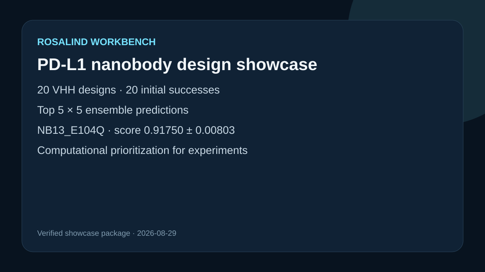

# PD-L1 nanobody design showcase

## Scientific question

Which conservative KN035-derived variants merit experimental follow-up after repeated Boltz-2 complex prediction against human PD-L1 residues 18–239?

## Source observations

- Target: UniProt Q9NZQ7 extracellular domain, residues 18–239.
- Structural parent: KN035 in PDB 5JDS.
- Twenty 130-residue VHH candidates were evaluated in the historical run; all initial predictions completed.
- The five leading designs were each resampled five times, yielding 25 successful ensemble predictions. One best-model CIF is retained in this public case.

## Computed result

NB13_E104Q ranked first with ensemble score 0.91750 ± 0.00803, protein ipTM 0.92386 ± 0.01084, interface pLDDT 0.92900, and no severe-clash models. The complete candidate table, top-five ranking, result summary, and best NB13 model are included.

## Interpretation

NB13_E104Q is the leading computational candidate in this specific scoring pipeline. The ranking prioritizes experimental testing; it does not establish affinity, specificity, expression, stability, or therapeutic activity.

## Rosalind observation

`outputs/rosalind-open-observation.json` records one genuine `mcp__rosalind__rosalind_open` call with molecular-design context. It returned the exact readiness message and did not execute a scientific job. The molecular-design result came from a separately completed Boltz-2 GPU run and retained scientific artifacts.

## Public inputs

`inputs/PDL1_Q9NZQ7_18-239.fasta` contains the target sequence verified against the free UniProt FASTA. `outputs/candidates.csv` retains the tag-free KN035 parent from PDB 5JDS and all 19 variants. `inputs/public-inputs.md` records the free acquisition URLs. `prepare_boltz_inputs.py` converts these retained sequences into Boltz YAML files without using a private path or saved task.

## Complete rerun

1. Create a fresh Python environment and install the free open-source packages: `python -m pip install --upgrade "boltz[cuda]" gemmi`. On CPU-only hardware, install `boltz` without the CUDA extra; prediction will be substantially slower.
2. Record `python -m pip show boltz gemmi` and `boltz predict --help` with the new run. The exact Boltz package version used for the historical snapshot was not retained, so a fresh run may differ.
3. Generate the 20 initial inputs: `python prepare_boltz_inputs.py --output-dir rerun/initial-inputs`.
4. Run one fixed-seed sample per candidate: `bash run_boltz.sh rerun/initial-inputs rerun/initial-predictions 1 20260829`.
5. Rank the initial screen: `python score_initial.py --candidates outputs/candidates.csv --predictions rerun/initial-predictions --output-dir rerun/initial-ranking`.
6. Read the five candidate names from `rerun/initial-ranking/top5.json`, pass them as a comma-separated value to `prepare_boltz_inputs.py --select`, and write `rerun/top5-inputs`.
7. Run five samples per selected candidate: `bash run_boltz.sh rerun/top5-inputs rerun/top5-predictions 5 20260829`.
8. Score the ensemble: `python score_ensemble.py --candidates outputs/candidates.csv --predictions rerun/top5-predictions --output-dir rerun/top5-ranking`.
9. Compare the fresh ranking with `outputs/top5_ensemble_ranking.csv`; treat differences as model, dependency, MSA, hardware, or stochastic drift until investigated.
10. Inspect `outputs/rosalind-open-observation.json` independently as interface evidence.
