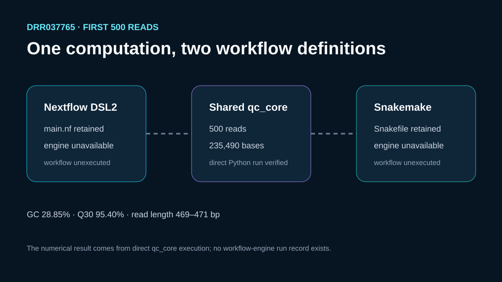

# Nextflow and Snakemake definitions for one FASTQ computation

## Scientific question

Can Nextflow DSL2 and Snakemake describe the same bounded FASTQ quality calculation while sharing one scientific implementation and one output contract?

## Public input

The input is the first 500 reads from ENA run `DRR037765`. `inputs/source-provenance.json` records the public ENA URL, subset rule, repository-relative retained path, and byte count; it contains no workstation path.

## Shared computation

`qc_core.py` validates every four-line FASTQ record and reports read count, total bases, minimum, maximum, and mean read length, GC percentage, and Q30 percentage. The retained direct Python result contains 500 reads and 235,490 bases, with GC 28.85% and Q30 95.40%.

Both workflow definitions call this same script:

- `workflows/nextflow/main.nf`
- `workflows/snakemake/Snakefile`

## Rosalind Workbench observation

A genuine `mcp__rosalind__rosalind_open` call with the FASTQ workflow-comparison context returned `Rosalind Workbench is ready. Choose a research task in the app.` with `ready=true`. The exact arguments and timestamps are stored in `outputs/rosalind-open-observation.json`.

This launcher observation did not run either workflow engine or the shared QC code. The numerical QC result came from the direct local Python execution recorded in `outputs/reference-qc.json`; `outputs/readiness.json` continues to record both engine runs as unexecuted.

## Execution status

The local readiness check found neither `nextflow` nor `snakemake` on `PATH`. Therefore, the two definitions and their output contract are inspectable plans, while `outputs/reference-qc.json` is the only executed numerical result. No dry run, workflow run, cache/resume test, engine timing, or engine output is claimed.

## Interpretation

The retained files demonstrate equivalent intended inputs, program, and output fields. They do not demonstrate that the two engines executed successfully or that their operational behavior is equivalent.

## Limitations

- Workflow-engine execution remains pending in an environment with the two engines installed.
- A 500-read subset is too small for throughput comparison.
- Sharing one Python program isolates orchestration syntax; it does not compare each engine's broader ecosystem.

## Reproduce

1. Run `python build_case.py` from this case directory to verify the retained public subset, direct computation, and readiness record. Use `--source-fastq <path>` only when replacing the retained subset with another independently acquired copy.
2. Inspect both workflow definitions and `outputs/workflow-contract.json`.
3. In a prepared environment, run each engine from a clean work directory and retain its version, command, logs, canonical output, and run record.
4. Inspect `outputs/rosalind-open-observation.json` independently from the direct QC result and workflow readiness record.
5. Compare engine outputs field by field before adding any claim of execution equivalence.
