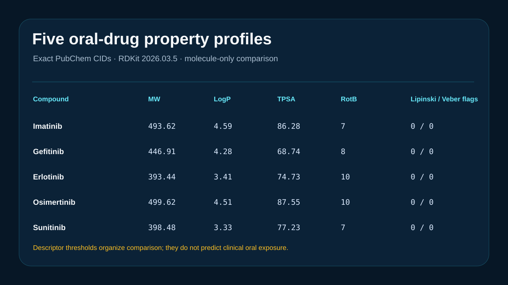

# Five oral-drug property profiles



## Scientific question

What can a reproducible molecule-only descriptor table reveal about five orally administered kinase-inhibitor reference drugs, and what remains unresolved?

## Source observations

`inputs/compounds.csv` retains exact PubChem records for imatinib (CID 5291), gefitinib (CID 123631), erlotinib (CID 176870), osimertinib (CID 71496458), and sunitinib (CID 5329102), including structures, formulas, molecular weights, XLogP, TPSA, hydrogen-bond counts, and rotatable bonds.

## Computed results

RDKit 2026.03.5 recomputes molecular weight, MolLogP, TPSA, hydrogen-bond counts, rotatable bonds, aromatic rings, fraction sp3, and QED. It also counts exceedances of four Lipinski thresholds and two Veber-style thresholds. All five molecules have zero exceedances under the exact definitions retained in `outputs/result-summary.json`.

The set still spans RDKit molecular weights from 393.44 to 499.62, MolLogP from 3.33 to 4.59, TPSA from 68.74 to 87.55 Ų, and QED from 0.311 to 0.626.

## Interpretation

Simple thresholds describe molecular-property regions and can support early comparison. The five reference drugs illustrate that satisfying these thresholds does not supply a clinical ranking or explain oral exposure by itself.

## Rosalind Workbench observation

The genuine `mcp__rosalind__rosalind_open` call at `2026-08-29T17:56:31.387Z` returned `Rosalind Workbench is ready. Choose a research task in the app.` with `ready=true`. The case-specific arguments and exact observed response are retained in `outputs/rosalind-open-observation.json`.

This operation only opens the Rosalind task chooser. It does not prove that an oral-property scientific task ran; the exact public records and deterministic local calculations above provide the scientific evidence in this case.

## Limitations

- No salt form, solid state, formulation, dissolution, permeability, transporter, metabolism, dose, or exposure data are modeled.
- QED and the listed descriptors are computed molecule-level quantities.
- Threshold exceedances do not rank efficacy, safety, developability, or probability of oral success.
- These are reference drugs, not prospectively selected development candidates.
- The Workbench chooser was opened, while no Rosalind scientific job was executed.

## Reproduce

```powershell
python showcases/rosalind-workbench/cases/rosalind-oral-candidates/scripts/analyze.py
```

Inspect `outputs/property-comparison.csv`, `outputs/result-summary.json`, `outputs/rosalind-open-observation.json`, and `previews/preview.svg`.
