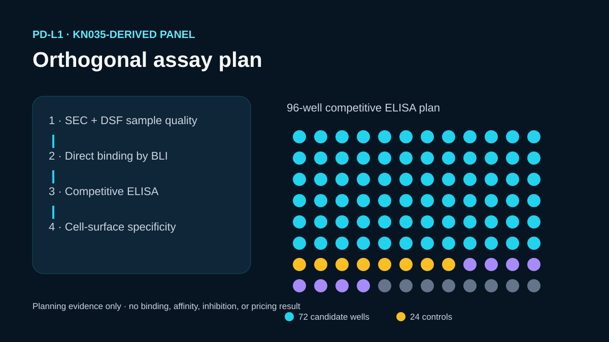

# Codex showcase lesson: PD-L1 binding assay plan

## Session prompt

Use $showcase-teacher to import and teach the ready showcase `rosalind-pdl1-assay-plan` (PD-L1 binding assay plan). Inspect its README, manifest, prompt, inputs, outputs, previews, and provenance records. Clearly distinguish source observations, computed results, scientific interpretation, and limitations, and show the preview when useful.

## Catalogue record

- Showcase ID: `rosalind-pdl1-assay-plan`
- Plugin: `rosalind-workbench` (Rosalind Workbench v0.2.2-research-preview)
- Status: `ready`
- Domain: `scientific-computing`
- Case type: `workflow`
- Difficulty: `advanced`
- Evidence level: `computed-result`
- Covered operations: `rosalind.rosalind_open`
- Rosalind tasks: `price-pdl1-assays`
- Actual tools: `Python 3.14 standard library`, `public KN035 literature and structural records`, `Rosalind Workbench mcp__rosalind__rosalind_open`
- Summary: Which orthogonal public assay methods could test ranked PD-L1 nanobody candidates?
- Recorded next step: Review the KN035 evidence and recalculate the 96-well layout for orthogonal PD-L1 affinity and specificity assays.
- Plugin guide: `showcases/rosalind-workbench/README.md`

## Repository files to inspect

- case guide: `showcases/rosalind-workbench/cases/rosalind-pdl1-assay-plan/README.md`
- case manifest: `showcases/rosalind-workbench/cases/rosalind-pdl1-assay-plan/showcase.json`
- teaching prompt: `showcases/rosalind-workbench/cases/rosalind-pdl1-assay-plan/prompt.md`
- input: `showcases/rosalind-workbench/cases/rosalind-pdl1-assay-plan/build_case.py`
- input: `showcases/rosalind-workbench/cases/rosalind-pdl1-assay-plan/inputs/KN035-public-evidence.md`
- output: `showcases/rosalind-workbench/cases/rosalind-pdl1-assay-plan/outputs/assay-plan.json`
- output: `showcases/rosalind-workbench/cases/rosalind-pdl1-assay-plan/outputs/competitive-elisa-plate-map.csv`
- output: `showcases/rosalind-workbench/cases/rosalind-pdl1-assay-plan/outputs/rosalind-open-observation.json`
- output: `showcases/rosalind-workbench/cases/rosalind-pdl1-assay-plan/outputs/teaching-bundle.md`
- preview: `showcases/rosalind-workbench/cases/rosalind-pdl1-assay-plan/previews/preview.svg`

## Public sources

- https://pmc.ncbi.nlm.nih.gov/articles/PMC5341541/
- https://www.rcsb.org/structure/5JDS
- https://www.uniprot.org/uniprotkb/Q9NZQ7/entry

## Retained case guide

# PD-L1 nanobody assay plan

## Scientific question

Which orthogonal assays could determine whether five computationally prioritized KN035 variants retain PD-L1 binding, block PD-1, and behave acceptably as purified VHHs?

## Public evidence

`inputs/KN035-public-evidence.md` links the open-access KN035 study, PDB 5JDS, and UniProt Q9NZQ7. It also identifies the published ELISA, BLI, and flow-cytometry methods that motivate the experiment sequence.

## Planning output

`outputs/assay-plan.json` defines four stages:

1. expression, identity, monodispersity, and thermal-stability checks;
2. direct binding by BLI with raw sensorgrams and fit residuals retained;
3. PD-1/PD-L1 competitive ELISA;
4. a cell-surface specificity check.

The competitive-ELISA map assigns all 96 wells: six candidates or controls at six concentrations in duplicate occupy 72 wells, while maximum-signal, no-PD-L1, and blank controls occupy 24 wells. This allocation is a deterministic calculation. It is not an assay result.

## Rosalind Workbench observation

A genuine `mcp__rosalind__rosalind_open` call with the PD-L1 assay-planning context returned `Rosalind Workbench is ready. Choose a research task in the app.` with `ready=true`. Its exact arguments and timestamps are retained in `outputs/rosalind-open-observation.json`.

The launcher observation shows only that the task chooser was available. The assay sequence and 96-well allocation were produced locally from the cited literature and deterministic Python code; no assay, price lookup, purchase, or wet-lab measurement was performed.

## Interpretation

Agreement between direct binding, competition, and cell-surface specificity would support advancing a candidate. Sample quality is assessed first because aggregation or poor expression can confound binding measurements. Any kinetic constant should be reported with the sensorgram, fitting model, and residuals.

## Limitations

- No candidate was expressed or tested in this case.
- The proposed BLI concentrations and immobilization format require pilot optimization.
- The KN035 paper reports reference measurements; those values cannot be assigned to new variants.
- No vendor quote or purchasing price was collected.

## Reproduce

1. Read the public evidence note and verify the cited assay descriptions.
2. Run `python build_case.py` to regenerate the plan and 96-well map.
3. Inspect every well assignment and the proposed controls.
4. Inspect `outputs/rosalind-open-observation.json` separately from the scientific plan.
5. Before laboratory use, adapt concentrations, tags, detection chemistry, and replicate counts to the available protein format and instruments.

## Retained execution prompt

# PD-L1 binding assay plan

Using the KN035 structural and biochemical paper as public evidence, design an orthogonal test sequence for the five retained Boltz-prioritized VHH candidates plus KN035. Generate a complete competitive-ELISA plate map, distinguish published methods from proposed parameters, and state plainly that no wet-lab or purchasing result exists. Inspect `outputs/rosalind-open-observation.json` as the genuine launcher-readiness record, and do not treat it as assay planning, pricing, or experimental evidence.

## Teaching note

Use this bundle to locate the evidence. Read the listed repository artifacts before presenting scientific claims, and keep observations, calculations, interpretation, and limitations distinct.
