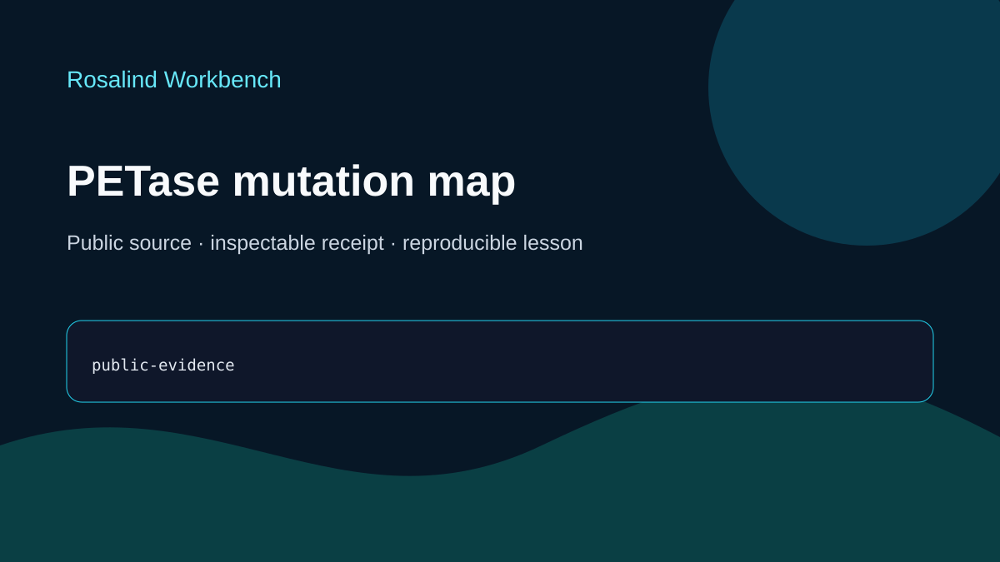

# Codex showcase lesson: PETase mutation map

## Session prompt

Use $showcase-teacher to import and teach the ready showcase `rosalind-petase-mutations` (PETase mutation map). Inspect its README, manifest, prompt, inputs, outputs, previews, and provenance records. Clearly distinguish source observations, computed results, scientific interpretation, and limitations, and show the preview when useful.

## Catalogue record

- Showcase ID: `rosalind-petase-mutations`
- Plugin: `rosalind-workbench` (Rosalind Workbench v0.2.2-research-preview)
- Status: `ready`
- Domain: `structure-and-sequence`
- Case type: `analysis`
- Difficulty: `intermediate`
- Evidence level: `multi-tool-result`
- Covered operations: `rosalind.rosalind_open`
- Rosalind tasks: `map-petase-mutations`
- Actual tools: `RCSB PDB public record inspection`, `Rosalind Workbench mcp__rosalind__rosalind_open`
- Summary: Where do reported PETase substitutions lie relative to the catalytic region?
- Recorded next step: Inspect PDB 5XJH and identify the coordinate and activity evidence still needed to place reported PETase substitutions.
- Plugin guide: `showcases/rosalind-workbench/README.md`

## Repository files to inspect

- case guide: `showcases/rosalind-workbench/cases/rosalind-petase-mutations/README.md`
- case manifest: `showcases/rosalind-workbench/cases/rosalind-petase-mutations/showcase.json`
- teaching prompt: `showcases/rosalind-workbench/cases/rosalind-petase-mutations/prompt.md`
- input: `showcases/rosalind-workbench/cases/rosalind-petase-mutations/inputs/public-source.md`
- output: `showcases/rosalind-workbench/cases/rosalind-petase-mutations/outputs/verification-receipt.json`
- output: `showcases/rosalind-workbench/cases/rosalind-petase-mutations/outputs/provenance.json`
- output: `showcases/rosalind-workbench/cases/rosalind-petase-mutations/outputs/rosalind-open-observation.json`
- output: `showcases/rosalind-workbench/cases/rosalind-petase-mutations/outputs/session-bundle.md`
- preview: `showcases/rosalind-workbench/cases/rosalind-petase-mutations/previews/preview.svg`

## Public sources

- https://www.rcsb.org/structure/5XJH
- installed-plugin://rosalind-workbench/tool-contract

## Retained case guide

# PETase mutation map

This ready teaching case establishes the public PETase reference structure and states exactly what would be needed to map already reported substitutions. It does not propose or introduce a mutation.

## Scientific question

Where do reported PETase substitutions lie relative to the catalytic region?

## Source observations

- RCSB PDB 5XJH is a 1.54 Å X-ray structure of PETase from *Ideonella sakaiensis*.
- The deposited entity is one 300-residue PETase chain with no mutation; the linked primary report describes a Ser–His–Asp catalytic triad.
- The retained case contains no substitution list or coordinate-distance calculation. It therefore does not establish where any reported substitution lies relative to the catalytic region.
- `map-petase-mutations` is the official Rosalind task that corresponds to this PETase mutation-mapping question. The association records scientific relevance; the retained launcher observation does not show that the task ran.

The dated, case-specific source summary is stored in `outputs/verification-receipt.json`; acquisition details are in `inputs/public-source.md`.

## Rosalind Workbench observation

One genuine `mcp__rosalind__rosalind_open` call was made with this case's task context at `2026-08-29T18:23:14.185Z`. It returned `Rosalind Workbench is ready. Choose a research task in the app.` with `ready=true`. Exact arguments, UTC and local timestamps, and `scientific_job_executed=false` are retained in `outputs/rosalind-open-observation.json` and cited by `outputs/provenance.json`.

The launcher observation establishes only that the task chooser was ready. It does not establish a scientific run and did not retrieve coordinates, map substitutions, modify a sequence, or estimate activity.

## Interpretation

PDB 5XJH is a suitable public reference for a later, explicitly parameterized distance analysis. Such an analysis would need named published substitutions, a defined catalytic-site representation, chain mapping, and a reported geometric criterion.

## Reproduce

1. Read `prompt.md` and `inputs/public-source.md`.
2. Inspect the current RCSB PDB 5XJH record and compare it with `outputs/verification-receipt.json`.
3. Verify `outputs/rosalind-open-observation.json` separately from the structural evidence.
4. Use `outputs/session-bundle.md` as the teaching index and review the preview.

## Limitations

- No substitution list or coordinate analysis is retained.
- No mutation, sequence change, activity calculation, or ranking was produced.
- The source record may change after the recorded date.

## Retained execution prompt

# PETase mutation map

Review public PDB 5XJH as the reference structure for evaluating already reported PETase substitutions. Keep source facts separate from any future coordinate calculation. Do not create, mutate, optimize, rank, or propose enzyme sequences or substitutions.

Record `map-petase-mutations` as the corresponding official Rosalind task ID while stating clearly that the task was not executed in this retained case.

Cite `outputs/verification-receipt.json` for the retained source summary and `outputs/rosalind-open-observation.json` for the genuine case-specific `mcp__rosalind__rosalind_open` response. The launcher observation records only a ready task chooser and does not establish that a scientific job ran.

## Teaching note

Use this bundle to locate the evidence. Read the listed repository artifacts before presenting scientific claims, and keep observations, calculations, interpretation, and limitations distinct.
