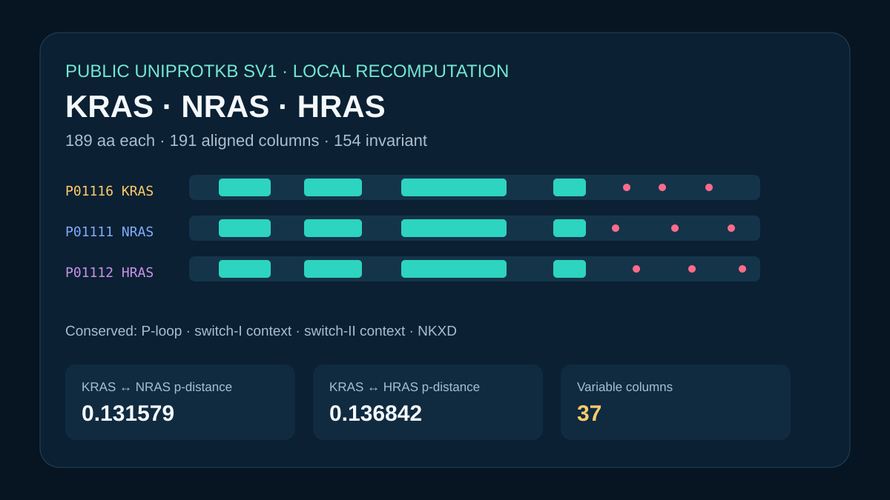

# Codex showcase lesson: Human RAS isoform comparison

## Session prompt

Use $showcase-teacher to import and teach the ready showcase `rosalind-ras-isoforms` (Human RAS isoform comparison). Inspect its README, manifest, prompt, inputs, outputs, previews, and provenance records. Clearly distinguish source observations, computed results, scientific interpretation, and limitations, and show the preview when useful.

## Catalogue record

- Showcase ID: `rosalind-ras-isoforms`
- Plugin: `rosalind-workbench` (Rosalind Workbench v0.2.2-research-preview)
- Status: `ready`
- Domain: `structure-and-sequence`
- Case type: `analysis`
- Difficulty: `intermediate`
- Evidence level: `computed-result`
- Covered operations: `rosalind-workbench.public-evidence`, `rosalind.rosalind_open`
- Rosalind tasks: none recorded
- Actual tools: `Rosalind Workbench mcp__rosalind__rosalind_open`, `UniProtKB reviewed SV1 records and Python 3 standard library`
- Summary: Which conserved and divergent positions distinguish HRAS, KRAS, and NRAS?
- Recorded next step: Repeat the deterministic comparison of the reviewed HRAS, KRAS, and NRAS UniProt sequences and verify divergent positions.
- Plugin guide: `showcases/rosalind-workbench/README.md`

## Repository files to inspect

- case guide: `showcases/rosalind-workbench/cases/rosalind-ras-isoforms/README.md`
- case manifest: `showcases/rosalind-workbench/cases/rosalind-ras-isoforms/showcase.json`
- teaching prompt: `showcases/rosalind-workbench/cases/rosalind-ras-isoforms/prompt.md`
- input: `showcases/rosalind-workbench/cases/rosalind-ras-isoforms/build_case.py`
- input: `showcases/rosalind-workbench/cases/rosalind-ras-isoforms/inputs/public-source.md`
- input: `showcases/rosalind-workbench/cases/rosalind-ras-isoforms/inputs/human-RAS-UniProt-SV1.aln-fasta`
- input: `showcases/rosalind-workbench/cases/rosalind-ras-isoforms/inputs/source-provenance.json`
- output: `showcases/rosalind-workbench/cases/rosalind-ras-isoforms/outputs/alignment-summary.json`
- output: `showcases/rosalind-workbench/cases/rosalind-ras-isoforms/outputs/variable-sites.csv`
- output: `showcases/rosalind-workbench/cases/rosalind-ras-isoforms/outputs/provenance.json`
- output: `showcases/rosalind-workbench/cases/rosalind-ras-isoforms/outputs/rosalind-open-observation.json`
- output: `showcases/rosalind-workbench/cases/rosalind-ras-isoforms/bundle.md`
- preview: `showcases/rosalind-workbench/cases/rosalind-ras-isoforms/previews/preview.svg`

## Public sources

- https://rest.uniprot.org/uniprotkb/P01116.fasta
- https://rest.uniprot.org/uniprotkb/P01111.fasta
- https://rest.uniprot.org/uniprotkb/P01112.fasta

## Retained case guide

# Human RAS isoform comparison



## Scientific question

Which conserved and divergent positions distinguish reviewed human KRAS, NRAS, and HRAS sequences?

## Public source observations

The retained aligned FASTA contains UniProtKB reviewed sequence-version-1 records `P01116` (KRAS), `P01111` (NRAS), and `P01112` (HRAS). Each ungapped sequence is 189 amino acids; `inputs/source-provenance.json` records the three official FASTA endpoints, response digests, sequence digests, and the exploratory center-star alignment parameters.

## Executed deterministic analysis

`build_case.py` reads all 191 alignment columns, maps columns to KRAS coordinates, compares each pair after excluding only double-gap columns, and writes every variable column to `outputs/variable-sites.csv`.

- 154 columns are invariant across all three aligned rows and 37 are variable.
- Uncorrected p-distances are 0.131579 for KRAS–NRAS, 0.136842 for KRAS–HRAS, and 0.157895 for NRAS–HRAS.
- The retained KRAS P-loop (10–17), switch-I context (30–38), switch-II context (60–76), and NKXD motif (116–119) are identical in all three rows.

These are sequence observations from the retained exploratory alignment. They do not establish isoform-specific biochemical effects.

## Observed Rosalind Workbench invocation

`mcp__rosalind__rosalind_open` was genuinely invoked for this case at `2026-08-29T18:20:46.529Z`. It returned exactly `Rosalind Workbench is ready. Choose a research task in the app.` with `ready=true`. The 891-byte `outputs/rosalind-open-observation.json` retains the arguments, UTC and local timestamps, response, and `scientific_job_executed=false`.

The launcher call only opened the task chooser. The aligned FASTA and local Python script are the evidence for the numerical results above.

## Limitations

- The center-star alignment is suitable for this compact teaching comparison; publication-grade evolutionary inference needs an independently validated alignment and substitution model.
- Variable columns include the hypervariable C termini and residue-gap differences.
- No Rosalind sequence analysis, wet-lab assay, functional assay, or clinical interpretation was performed.

## Reproduce

From the repository root:

```powershell
python showcases/rosalind-workbench/cases/rosalind-ras-isoforms/build_case.py
python scripts/showcase_session.py bundle rosalind-ras-isoforms --output showcases/rosalind-workbench/cases/rosalind-ras-isoforms/bundle.md
```

The script requires all three expected accessions, equal alignment widths, and a self-consistent variable-site table.

## Retained execution prompt

# Human RAS isoform comparison

Recompute the 191-column retained alignment of reviewed UniProtKB SV1 records `P01116`, `P01111`, and `P01112`. Report invariant and variable columns, the three uncorrected pairwise p-distances, and the conservation state of the four retained KRAS motifs. Keep source observations, calculations, interpretation, and limitations distinct. Invoke `mcp__rosalind__rosalind_open` only to open the task chooser; cite the exact 891-byte `outputs/rosalind-open-observation.json` and state that no Rosalind scientific job ran.

## Teaching note

Use this bundle to locate the evidence. Read the listed repository artifacts before presenting scientific claims, and keep observations, calculations, interpretation, and limitations distinct.
