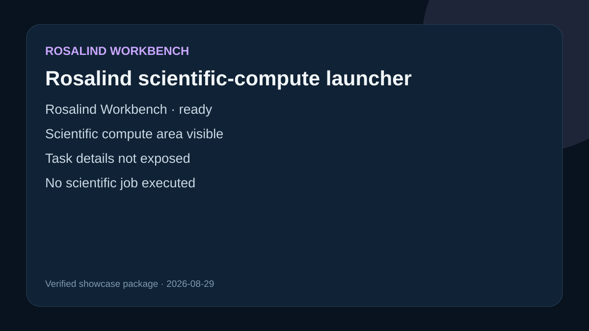

# Rosalind scientific-compute launcher

## Observed interface state

Rosalind Workbench returned schema `life-sciences.launcher/v1`, reported `ready: true`, and displayed its launcher. The visible scientific areas included molecular design, structure analysis, genomics, and scientific compute.

## Retained request and replay route

Reproduce opens the scientific-compute area and performs the three local NGS discovery requests retained in `inputs/runtime-discovery-request.json`: workflow inventory, runtime-environment discovery, and compute-target discovery. This route has no biological input file and does not create a plan or start a job.

## Limitation

The original launcher observation did not expose the underlying task list or task descriptions. Discovery responses describe the active host only; they do not demonstrate workflow execution or scientific analysis.
