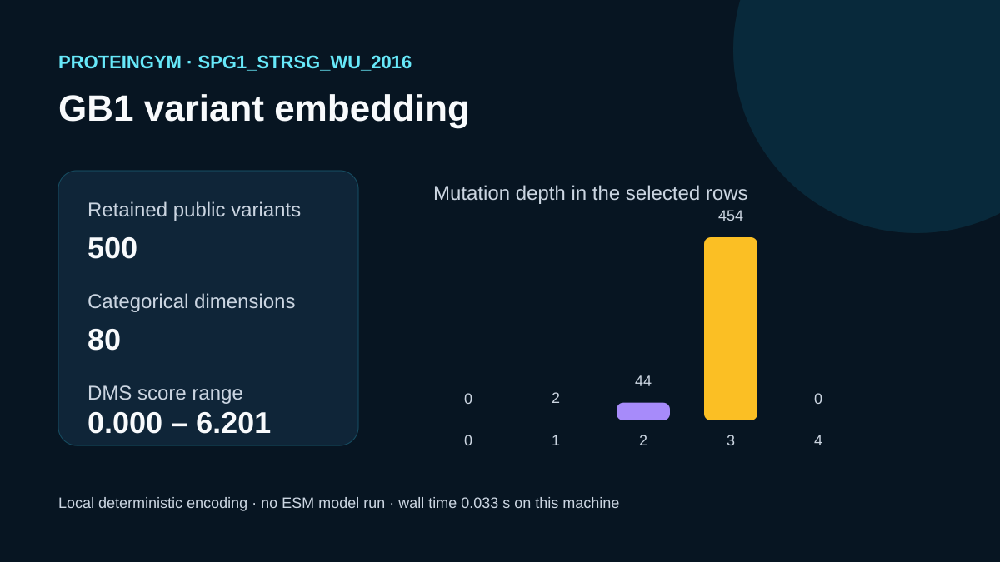

# Codex showcase lesson: GB1 sequence embeddings

## Session prompt

Use $showcase-teacher to import and teach the ready showcase `rosalind-scientific-compute` (GB1 sequence embeddings). Inspect its README, manifest, prompt, inputs, outputs, previews, and provenance records. Clearly distinguish source observations, computed results, scientific interpretation, and limitations, and show the preview when useful.

## Catalogue record

- Showcase ID: `rosalind-scientific-compute`
- Plugin: `rosalind-workbench` (Rosalind Workbench v0.2.2-research-preview)
- Status: `ready`
- Domain: `scientific-computing`
- Case type: `analysis`
- Difficulty: `advanced`
- Evidence level: `computed-result`
- Covered operations: `rosalind.rosalind_open`
- Rosalind tasks: `embed-gb1-sequences`
- Actual tools: `Python 3.14 standard library`, `Rosalind Workbench mcp__rosalind__rosalind_open`
- Summary: How can 500 public GB1 variants be embedded with a free local protein model and timed reproducibly?
- Recorded next step: Recreate the 80-dimensional one-hot encodings for the first 500 ProteinGym GB1 variants and compare timing metrics.
- Plugin guide: `showcases/rosalind-workbench/README.md`

## Repository files to inspect

- case guide: `showcases/rosalind-workbench/cases/rosalind-scientific-compute/README.md`
- case manifest: `showcases/rosalind-workbench/cases/rosalind-scientific-compute/showcase.json`
- teaching prompt: `showcases/rosalind-workbench/cases/rosalind-scientific-compute/prompt.md`
- input: `showcases/rosalind-workbench/cases/rosalind-scientific-compute/build_case.py`
- input: `showcases/rosalind-workbench/cases/rosalind-scientific-compute/inputs/source-provenance.json`
- input: `showcases/rosalind-workbench/cases/rosalind-scientific-compute/inputs/gb1-variants-first-500.csv`
- output: `showcases/rosalind-workbench/cases/rosalind-scientific-compute/outputs/embedding-summary.json`
- output: `showcases/rosalind-workbench/cases/rosalind-scientific-compute/outputs/gb1-four-site-one-hot.csv`
- output: `showcases/rosalind-workbench/cases/rosalind-scientific-compute/outputs/run-metrics.json`
- output: `showcases/rosalind-workbench/cases/rosalind-scientific-compute/outputs/rosalind-open-observation.json`
- output: `showcases/rosalind-workbench/cases/rosalind-scientific-compute/outputs/teaching-bundle.md`
- preview: `showcases/rosalind-workbench/cases/rosalind-scientific-compute/previews/preview.svg`

## Public sources

- https://marks.hms.harvard.edu/proteingym/ProteinGym_v1.3/DMS_ProteinGym_substitutions.zip
- https://github.com/OATML-Markslab/ProteinGym

## Retained case guide

# GB1 four-site variant embeddings

## Scientific question

What does a transparent categorical embedding retain from a bounded public sample of the four-site GB1 binding landscape, and how quickly can it be generated locally?

## Public input and computation

The retained input contains the first 500 data rows of ProteinGym v1.3 assay `SPG1_STRSG_Wu_2016`. ProteinGym distributes the assay in its public substitution benchmark archive. `inputs/source-provenance.json` records the archive URL, member name, retrieval date, and row-selection rule.

For each variant, `build_case.py` extracts full-protein positions 265, 266, 267, and 280. Each residue is represented by one of 20 amino-acid states, producing an 80-dimensional one-hot vector. This is a small, deterministic teaching representation. No ESM checkpoint or sequence viewer was run.

## Verified result

- 500 retained variants, each with a 448-residue full-protein sequence
- 80 embedding dimensions covering four assayed positions
- a case-specific DMS-score summary and mutation-depth distribution in `outputs/embedding-summary.json`
- per-run Python, platform, wall time, and exit status in `outputs/run-metrics.json`

The DMS scores are source observations from ProteinGym. The one-hot vectors, mutation depths, and descriptive statistics are local computations.

`outputs/rosalind-open-observation.json` records a genuine `mcp__rosalind__rosalind_open` call made with scientific-computing context. It confirmed that the launcher was ready and records that no Rosalind scientific job executed. The GB1 encoding remains a separate local Python result.

## Interpretation

The representation preserves the categorical identity of every assayed residue and is directly inspectable. It is suitable for teaching data preparation or as input to a simple downstream model. It does not encode evolutionary context, structural context, or language-model features.

## Limitations

- The first 500 archive rows are a deterministic sample, not a balanced or random sample of the full landscape.
- The measured phenotype is the assay's GB1 binding score; it should not be generalized to other proteins or experimental settings.
- Timing depends on hardware, storage, and the Python runtime.
- No ESM inference was performed.

## Reproduce

1. Download the ProteinGym v1.3 substitution archive from the URL in `inputs/source-provenance.json`.
2. Run `python build_case.py --archive <path-to-DMS_ProteinGym_substitutions.zip>`.
3. Confirm that the input and embedding CSV files each contain 500 data rows.
4. Compare `outputs/embedding-summary.json` and inspect the generated preview.
5. Inspect `outputs/rosalind-open-observation.json` separately as launcher-readiness evidence.

## Retained execution prompt

# GB1 variant embeddings

From the first 500 variants of ProteinGym assay `SPG1_STRSG_Wu_2016`, encode the four assayed GB1 positions as an 80-dimensional categorical vector. Record the source release, row-selection rule, score summary, mutation-depth distribution, Python version, and wall time. Do not describe this encoding as an ESM result.

Use `outputs/rosalind-open-observation.json` only to report the exact `mcp__rosalind__rosalind_open` launcher observation. It did not execute the GB1 computation.

## Teaching note

Use this bundle to locate the evidence. Read the listed repository artifacts before presenting scientific claims, and keep observations, calculations, interpretation, and limitations distinct.
