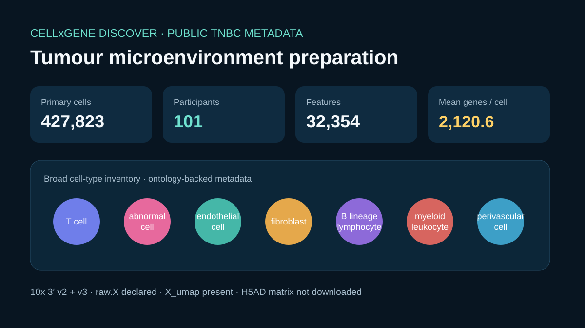

# Triple-negative breast-cancer single-cell preparation



## Scientific question

What public metadata must be verified before cell-state exploration of an untreated triple-negative breast-cancer single-cell atlas?

## Public collection

The retained CELLxGENE Discover response describes collection `ceef2841-5333-46ac-92ef-ccbe0c20fe55`, *Single-cell atlas of untreated human triple negative breast cancer*. It was retrieved through the official collection API at `2026-08-29T18:22:32.428743Z` using the repository's CELLxGENE skill.

The single dataset is human breast tissue annotated as triple-negative breast carcinoma (`MONDO:0005494`). The metadata lists 10x 3′ v2 and v3 assays, 427,823 primary cells, 32,354 features, an aggregate study-participant count of 101, mean genes per cell 2,120.624429, `raw.X`, and `X_umap`.

## Executed deterministic preparation check

`build_case.py` verifies collection and dataset identifiers, checks the aggregate participant count, preserves assay and ontology records, and writes the seven broad cell-type labels to `outputs/cell-type-inventory.csv`:

- T cell
- abnormal cell
- endothelial cell
- fibroblast
- lymphocyte of B lineage
- myeloid leukocyte
- perivascular cell

These broad labels and the UMAP inventory make a cell-state review technically approachable. They do not show cell proportions, marker expression, cluster quality, patient effects, or tumour–immune interactions.

## Data-use note

The retained input is a public-metadata extract with contact fields and all study participant pseudonyms removed. It preserves the reported cohort size as a single aggregate value. This case contains single-cell collection metadata only and has no pathology or Visium task association.

## Observed Rosalind Workbench invocation

`mcp__rosalind__rosalind_open` was genuinely invoked at `2026-08-29T18:21:04.136Z`. It returned exactly `Rosalind Workbench is ready. Choose a research task in the app.` with `ready=true`. The 923-byte `outputs/rosalind-open-observation.json` retains the case-specific arguments, timestamps, response, and `scientific_job_executed=false`.

The launcher call did not receive cells or an H5AD. The retained CELLxGENE metadata and local script support the preparation summary.

## Limitations

- The 4.52 GB H5AD asset was not downloaded; no expression matrix or cell-level row was inspected.
- Broad CELLxGENE labels cannot substitute for study-specific cell-state annotation.
- Assay-version mixing and participant effects need explicit modelling in a full analysis.
- The aggregate count cannot support participant-aware modelling by itself; a full analysis must obtain the required grouping variables through an appropriate data-use procedure.
- No Rosalind single-cell analysis, clinical inference, or wet-lab work was executed.

## Reproduce

```powershell
python showcases/rosalind-workbench/cases/rosalind-single-cell-tme/build_case.py
python scripts/showcase_session.py bundle rosalind-single-cell-tme --output showcases/rosalind-workbench/cases/rosalind-single-cell-tme/bundle.md
```
