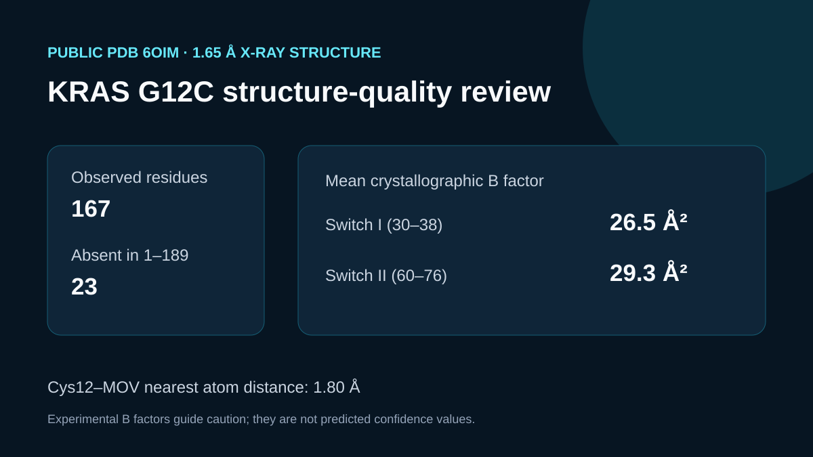

# KRAS G12C experimental-reference review

## Scientific question

Which regions of a KRAS G12C model deserve added caution when compared with the 1.65 Å experimental structure in PDB 6OIM?

## Public source and computation

`build_case.py` downloads public PDB 6OIM, retains the deposited coordinates, and computes per-residue mean crystallographic B factors and nearest distances to Cys12 and the covalent ligand MOV. `inputs/source-provenance.json` records the exact source and selection.

## Computed result

- Chain A contains 167 observed residue records, including a numbered residue 0; residues 105–107 and 170–189 are absent within the reviewed 1–189 span.
- Cys12 is 1.805 Å from the nearest MOV atom in the deposited coordinates.
- Mean B factors are 26.486 Ų for switch I (30–38) and 29.300 Ų for switch II (60–76), compared with 19.788 Ų for the P-loop (10–17).
- The complete per-residue table is retained in `outputs/residue-quality-metrics.csv`.

## Interpretation

Absent coordinates and relatively elevated B factors identify regions that deserve extra attention when a prediction is interpreted. Crystallographic B factors are experimental-model properties and must not be relabeled as predicted confidence scores.

## Rosalind observation

`outputs/rosalind-open-observation.json` records one genuine `mcp__rosalind__rosalind_open` call with structure-analysis context. The response confirmed launcher readiness; `scientific_job_executed` is false. The numerical structure analysis came from local Python applied to public 6OIM coordinates.

## Limitations

- 6OIM is a ligand-bound crystallographic state, so its conformational and B-factor patterns are not universal KRAS G12C properties.
- PDB residue numbering and absent density must be interpreted with the deposited sequence and experimental conditions.
- The analysis does not generate or validate a structure prediction and has no clinical interpretation.

## Reproduce

1. Run `python build_case.py` from this case directory.
2. Confirm that the retained PDB has 167 chain-A residue records and resolution 1.65 Å.
3. Compare `outputs/structure-summary.json` and `outputs/residue-quality-metrics.csv` with the preview.
4. Inspect `outputs/rosalind-open-observation.json` separately; it is interface evidence only.
