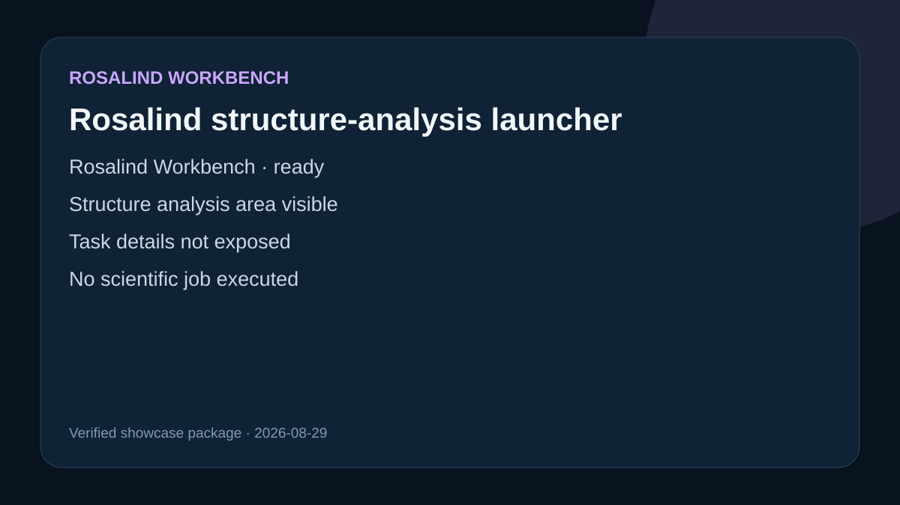

# Rosalind structure-analysis launcher

## Observed interface state

Rosalind Workbench returned schema `life-sciences.launcher/v1`, reported `ready: true`, and displayed its launcher. The visible scientific areas included molecular design, structure analysis, genomics, and scientific compute.

## Retained data and replay route

Reproduce opens the structure-analysis area, then passes the shared pinned `1YCR.pdb` fixture to the local Structure service and reads the resulting viewer state. Replay also includes the retained 4 Å MDM2-p53 coordinate-contact result and its RCSB method record from `structure-mdm2-p53`.

## Limitation

The original launcher observation did not expose the underlying task list or task descriptions. Its recorded ready state does not claim that a scientific job ran; the retained 1YCR result is reported separately and is a coordinate analysis, not an affinity measurement.
