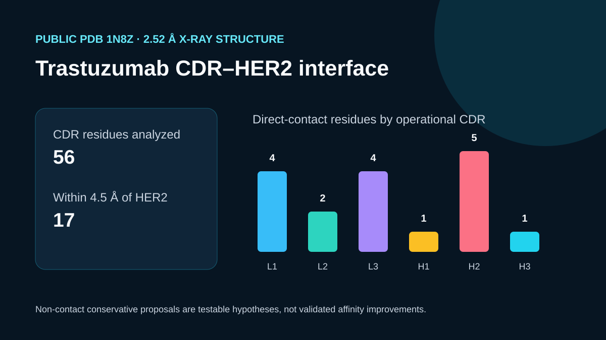

# Codex showcase lesson: Trastuzumab CDR refinement

## Session prompt

Use $showcase-teacher to import and teach the ready showcase `rosalind-trastuzumab-cdr` (Trastuzumab CDR refinement). Inspect its README, manifest, prompt, inputs, outputs, previews, and provenance records. Clearly distinguish source observations, computed results, scientific interpretation, and limitations, and show the preview when useful.

## Catalogue record

- Showcase ID: `rosalind-trastuzumab-cdr`
- Plugin: `rosalind-workbench` (Rosalind Workbench v0.2.2-research-preview)
- Status: `ready`
- Domain: `protein-and-antibody-design`
- Case type: `workflow`
- Difficulty: `advanced`
- Evidence level: `multi-tool-result`
- Covered operations: `rosalind.rosalind_open`
- Rosalind tasks: `improve-trastuzumab-cdrs`
- Actual tools: `Python 3.14 standard library`, `Rosalind Workbench mcp__rosalind__rosalind_open`
- Summary: How can CDR substitutions be prioritized without changing the HER2 epitope hypothesis?
- Recorded next step: Recompute PDB 1N8Z CDR-to-HER2 contacts and restrict substitution review to supported non-contact positions.
- Plugin guide: `showcases/rosalind-workbench/README.md`

## Repository files to inspect

- case guide: `showcases/rosalind-workbench/cases/rosalind-trastuzumab-cdr/README.md`
- case manifest: `showcases/rosalind-workbench/cases/rosalind-trastuzumab-cdr/showcase.json`
- teaching prompt: `showcases/rosalind-workbench/cases/rosalind-trastuzumab-cdr/prompt.md`
- input: `showcases/rosalind-workbench/cases/rosalind-trastuzumab-cdr/build_case.py`
- input: `showcases/rosalind-workbench/cases/rosalind-trastuzumab-cdr/inputs/public-source.md`
- input: `showcases/rosalind-workbench/cases/rosalind-trastuzumab-cdr/inputs/source-provenance.json`
- input: `showcases/rosalind-workbench/cases/rosalind-trastuzumab-cdr/inputs/1N8Z.pdb`
- output: `showcases/rosalind-workbench/cases/rosalind-trastuzumab-cdr/outputs/cdr-contact-metrics.csv`
- output: `showcases/rosalind-workbench/cases/rosalind-trastuzumab-cdr/outputs/conservative-exploration-set.csv`
- output: `showcases/rosalind-workbench/cases/rosalind-trastuzumab-cdr/outputs/interface-summary.json`
- output: `showcases/rosalind-workbench/cases/rosalind-trastuzumab-cdr/outputs/rosalind-open-observation.json`
- output: `showcases/rosalind-workbench/cases/rosalind-trastuzumab-cdr/outputs/teaching-bundle.md`
- preview: `showcases/rosalind-workbench/cases/rosalind-trastuzumab-cdr/previews/preview.svg`

## Public sources

- https://www.rcsb.org/structure/1N8Z
- https://files.rcsb.org/download/1N8Z.pdb

## Retained case guide

# Trastuzumab CDR refinement

## Scientific question

Which trastuzumab CDR positions directly contact HER2 in public PDB 1N8Z, and which distant positions can be reserved for conservative exploration?

## Public source and computation

`build_case.py` downloads public PDB 1N8Z and analyzes explicit operational CDR ranges on light chain A and heavy chain B against HER2 chain C. It records each CDR residue's nearest HER2 distance, direct HER2 contacts within 4.5 Å, and mean crystallographic B factor.

## Computed result

- 56 residues are included across six operational CDR ranges.
- 17 CDR residues lie within 4.5 Å of HER2 in this crystal structure.
- Direct-contact positions include light-chain Asp28, Asn30, Thr31, Ala32, Ser50, Phe53, His91, Tyr92, Thr93, Thr94 and heavy-chain Tyr33, Arg50, Tyr52, Tyr57, Thr58, Arg59, Trp99.
- `outputs/conservative-exploration-set.csv` lists 12 conservative substitutions at positions at least 8 Å from HER2. They are hypotheses for later testing, not established improvements.

## Interpretation

The direct-contact set should receive the strongest preservation preference when the HER2 epitope hypothesis is maintained. Distant CDR positions offer a more cautious starting set for sequence exploration, followed by structural modeling, developability screening, and binding experiments.

## Rosalind observation

`outputs/rosalind-open-observation.json` records one genuine `mcp__rosalind__rosalind_open` call with trastuzumab CDR context. It confirmed launcher readiness and records `scientific_job_executed: false`. The contact analysis came from the local retained script and public 1N8Z coordinates.

## Limitations

- The CDR ranges are an explicit operational definition, not a universal numbering convention.
- One 2.52 Å crystal structure cannot describe all solution conformations or mutation-induced rearrangements.
- Distance from HER2 does not prove that a substitution preserves folding, affinity, specificity, or developability.
- No candidate was modeled or tested experimentally.

## Reproduce

1. Run `python build_case.py` from this case directory.
2. Confirm 56 analyzed CDR residues and 17 residues within 4.5 Å of HER2.
3. Inspect `outputs/cdr-contact-metrics.csv`, `outputs/conservative-exploration-set.csv`, and `outputs/interface-summary.json`.
4. Read `outputs/rosalind-open-observation.json` separately as launcher evidence.

## Retained execution prompt

# Trastuzumab CDR refinement

Map explicit trastuzumab CDR ranges in public PDB 1N8Z to HER2 chain C. Retain residue-level distances, preserve direct-contact positions, and generate a small conservative exploration set only from positions at least 8 Å from HER2. Present every substitution as a hypothesis that still requires modeling and experiments.

Read `outputs/rosalind-open-observation.json` as a genuine `mcp__rosalind__rosalind_open` launcher observation. Do not claim that Rosalind executed the contact analysis.

## Teaching note

Use this bundle to locate the evidence. Read the listed repository artifacts before presenting scientific claims, and keep observations, calculations, interpretation, and limitations distinct.
