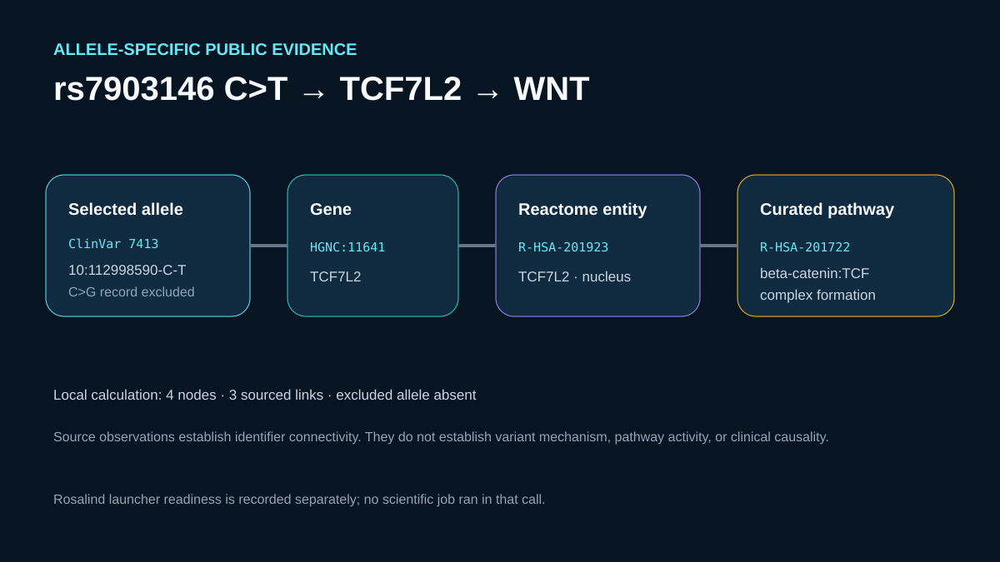

# rs7903146 C>T to TCF7L2 and WNT pathway evidence

## Scientific question

How can the public rs7903146 C>T record be connected to TCF7L2 and a curated WNT pathway without implying that a database link proves molecular or clinical causality?

## Public source observations

- ClinVar Variation ID `7413` identifies the C>T allele as `NC_000010.11:g.112998590C>T` and places it in a TCF7L2 intron. The distinct C>G record is excluded.
- The retained Ensembl result identifies the same rsID as a dbSNP-imported variant and includes the ClinVar cross-reference `VCV000007413`.
- Reactome entity `R-HSA-201923` identifies human TCF7L2 in the nucleoplasm and places it in curated WNT-related events.
- Reactome pathway `R-HSA-201722` describes formation of a beta-catenin:TCF transcriptional complex and includes TCF7L2 among the TCF/LEF family members.

The exact identifiers, URLs, access date, and evidence classes appear in `inputs/public-source.md` and `outputs/verification-receipt.json`.

## Local calculation

The retained result constructs one identifier-preserving path with four nodes and three typed links: selected C>T allele → TCF7L2 gene → TCF7L2 Reactome entity → beta-catenin:TCF pathway. The calculation checks that every link has a public source and that the excluded C>G allele never enters the path.

This is an evidence-organization calculation. It does not estimate effect size, gene regulation, disease risk, or pathway activity.

## Rosalind Workbench observation

A genuine `mcp__rosalind__rosalind_open` call with the rs7903146-to-pathway context returned `Rosalind Workbench is ready. Choose a research task in the app.` with `ready=true`. The exact arguments and timestamps are retained in `outputs/rosalind-open-observation.json`.

That call opened only the chooser. It did not retrieve or classify the variant and did not perform the local evidence-path calculation.

## Interpretation

The path supports a cautious statement: the selected public allele maps to TCF7L2 identifiers, and curated Reactome records place TCF7L2 in WNT signaling. It does not show that rs7903146 changes TCF7L2 function through the named pathway in any particular tissue or person.

## Limitations

- ClinVar, Ensembl, and Reactome records can change after the recorded access date.
- The compact case reuses the allele-resolved public results retained by `databases-variant-interpretation`; it does not repeat remote API calls.
- No expression, chromatin, perturbation, phenotype, clinical, or experimental evidence is analyzed here.
- The pathway connection is a curated identifier path, not a causal mechanism.

## Reproduce

1. Read `inputs/public-source.md` and verify the selected C>T identifiers independently of the excluded C>G allele.
2. Inspect `outputs/verification-receipt.json` and confirm four nodes, three typed links, and a source for each link.
3. Inspect `outputs/rosalind-open-observation.json` separately from the scientific evidence.
4. Review the preview and report source observations, local calculation, interpretation, and limitations separately.
