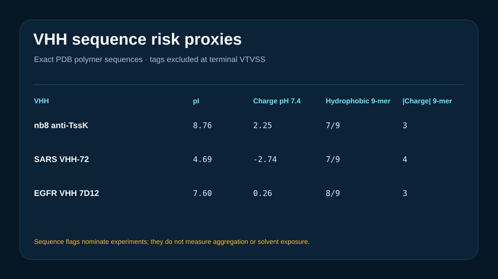

# VHH sequence aggregation-risk screen



## Scientific question

Which hydrophobic, charged, and chemical-liability sequence patterns merit experimental follow-up in three exact public VHH records?

## Source observations

- PDB 5M2W supplies llama nanobody nb8 against TssK.
- PDB 6WAQ supplies llama SARS VHH-72.
- PDB 4KRL supplies llama EGFR VHH 7D12.
- `inputs/vhh-polymer-sequences.fasta` preserves each complete RCSB polymer sequence. The analysis stops at its terminal `VTVSS`, excluding only the retained C-terminal tag or cloning residues.

## Computed results

The local script reports pI, net charge at pH 7.4, hydrophobic fraction, strongest hydrophobic and charge 9-residue windows, motif flags, and a C...WGQG conserved-motif segment used as a CDR3-like proxy.

The predicted net charges at pH 7.4 are +2.25 for nb8, -2.74 for VHH-72, and +0.26 for 7D12. Their strongest hydrophobic 9-residue windows contain 7, 7, and 8 hydrophobic residues. VHH-72 has the largest absolute local charge score (4). Exact windows, positions, and motif flags are retained in the output tables.

## Interpretation

Hydrophobic or highly charged local windows can guide structure-aware review and experimental aggregation testing. Sequence alone cannot establish whether a patch is solvent-exposed or whether a VHH will aggregate under a particular formulation.

## Rosalind Workbench observation

The genuine `mcp__rosalind__rosalind_open` call at `2026-08-29T17:56:31.343Z` returned `Rosalind Workbench is ready. Choose a research task in the app.` with `ready=true`. The case-specific arguments and exact observed response are retained in `outputs/rosalind-open-observation.json`.

This operation only opens the Rosalind task chooser. It does not prove that a VHH scientific task ran; the exact public sequences and deterministic local calculations above provide the scientific evidence in this case.

## Limitations

- No solvent-accessibility, three-dimensional patch, formulation, concentration, thermal stress, or aggregation experiment was included.
- The CDR3-like segment uses a conserved sequence pattern and is not an IMGT-numbered CDR assignment.
- pI and charge use fixed residue pKa assumptions.
- The VHHs bind different antigens and are not controlled variants of one scaffold.
- No laboratory developability claim is made. The Workbench chooser was opened, while no Rosalind scientific job was executed.

## Reproduce

```powershell
python showcases/rosalind-workbench/cases/rosalind-vhh-aggregation/scripts/analyze.py
```

Inspect `outputs/vhh-sequence-metrics.csv`, `outputs/motif-liabilities.csv`, `outputs/result-summary.json`, `outputs/rosalind-open-observation.json`, and `previews/preview.svg`.
