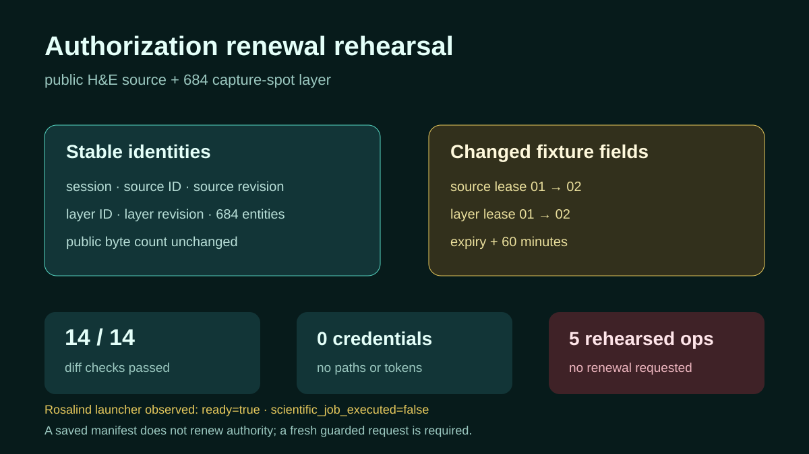

# Source and scientific-layer authorization rehearsal

## Scientific question

How can a reviewer verify that a renewed source and scientific-layer lease still refers to the same scientific content and entity collection?

## Source and manifests

`inputs/public-source.md` identifies the CC BY 4.0 mouse-brain H&E H5AD and the retained 684-row capture-spot table by exact byte count and SHA-256. `inputs/authorization-before.json` and `inputs/authorization-after.json` contain self-contained fixture identities. They do not contain credentials or private paths.

## Local validation

`outputs/authorization-diff.csv` contains fourteen explicit comparisons. Eight scientific identity fields remain fixed; four lease fields change; credentials and viewer execution remain false. `outputs/authorization-validation.json` records the current capability names and their rehearsed status. Running `python validate_case.py` checks the comparison and expiry ordering.

## Rosalind Workbench observation

`outputs/rosalind-open-observation.json` records a genuine case-specific call to `mcp__rosalind__rosalind_open` at `2026-08-29T17:56:30.746Z`. The exact response was “Rosalind Workbench is ready. Choose a research task in the app.” with `ready=true`. This opened the task chooser only; it did not renew source or layer authorization or execute another scientific job.

## Current Slide Viewer operations

- `slide-viewer.slide_renew_source_authorization` — rehearsed
- `slide-viewer.slide_renew_scientific_layer_authorization` — rehearsed
- `slide-viewer.slide_list_workflow_sources` — rehearsed
- `slide-viewer.slide_get_scientific_layer_import` — rehearsed
- `slide-viewer.slide_list_scientific_layers` — rehearsed

No renewal or listing operation was called.

## Interpretation

The manifests demonstrate an auditable comparison pattern: content identity and entity coverage remain fixed, while short-lived authorization metadata changes. They do not themselves provide read permission.

## Limitations

- Lease labels and times are deterministic fixtures, not issued grants.
- No source or scientific layer was imported, renewed, listed, or queried.
- Visium observations are capture spots, not single cells.
- Matrix `X` value scale remains unknown.

## Reproduce

1. Run `python validate_case.py` from this directory.
2. Review all fourteen rows in `outputs/authorization-diff.csv`.
3. Confirm the before/after JSON files contain no credential or private path fields.
4. In a later live session, preserve actual returned expiries and stable source/layer identities in a new record.
