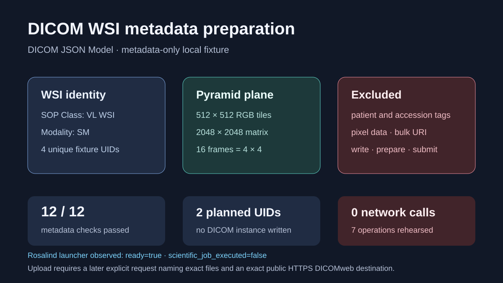

# Metadata-only DICOM WSI export preparation

## Scientific question

Which metadata and safety checks can be completed locally before any DICOM object import, export, or DICOMweb upload is authorized?

## Public standard and fixture

`inputs/public-source.md` cites DICOM PS3.18 2026c for the JSON model and PS3.4 2026c for the VL Whole Slide Microscopy Image Storage SOP Class UID. `inputs/dicom-metadata.json` contains one compact, synthetic DICOM JSON object with deterministic `2.25` fixture UIDs. It has no patient identifiers, accession, institution, pixel data, bulk-data URI, path, or credential.

## Local validation

`outputs/dicom-metadata-validation.csv` records twelve passing checks. The metadata describes sixteen 512 × 512 RGB frames covering one 2048 × 2048 total pixel matrix. `outputs/dicom-export-plan.json` assigns two new fixture UIDs but leaves the destination empty and records that no DICOM object was written. Running `python validate_case.py` checks the metadata and writes `outputs/local-validation.json`.

## Rosalind Workbench observation

`outputs/rosalind-open-observation.json` records a genuine case-specific call to `mcp__rosalind__rosalind_open` at `2026-08-29T17:56:30.767Z`. The exact response was “Rosalind Workbench is ready. Choose a research task in the app.” with `ready=true`. This opened the task chooser only; it did not execute a DICOM operation or any other scientific job.

## Current Slide Viewer operations

- `slide-viewer.slide_query_dicomweb` — rehearsed
- `slide-viewer.slide_inspect_dicomweb_instance` — rehearsed
- `slide-viewer.slide_read_dicomweb_object` — rehearsed
- `slide-viewer.slide_import_dicom_object` — rehearsed
- `slide-viewer.slide_export_dicom_object` — rehearsed
- `slide-viewer.slide_prepare_dicom_upload` — rehearsed
- `slide-viewer.slide_submit_dicom_upload` — rehearsed

None of these operations was called.

## Interpretation

The metadata checks establish internal consistency for a teaching fixture and make the omitted sensitive and pixel-bearing fields visible. They do not establish that a valid Part 10 instance exists or that any remote system would accept it.

## Limitations

- The fixture is metadata-only and contains no functional groups, optical-path sequence, dimension organization, specimen module, pixel data, or file meta information.
- No DICOM object was imported, exported, transcoded, de-identified, or rendered.
- No endpoint was named and no upload was prepared or submitted.
- A later upload would require an explicit request naming the exact original files and exact public HTTPS DICOMweb destination.

## Reproduce

1. Run `python validate_case.py` from this directory.
2. Inspect all twelve checks in `outputs/dicom-metadata-validation.csv`.
3. Confirm `outputs/dicom-export-plan.json` has a null destination and false write/prepare/submit fields.
4. Treat any later object creation or network operation as a new execution with its own actual byte and hash records.
