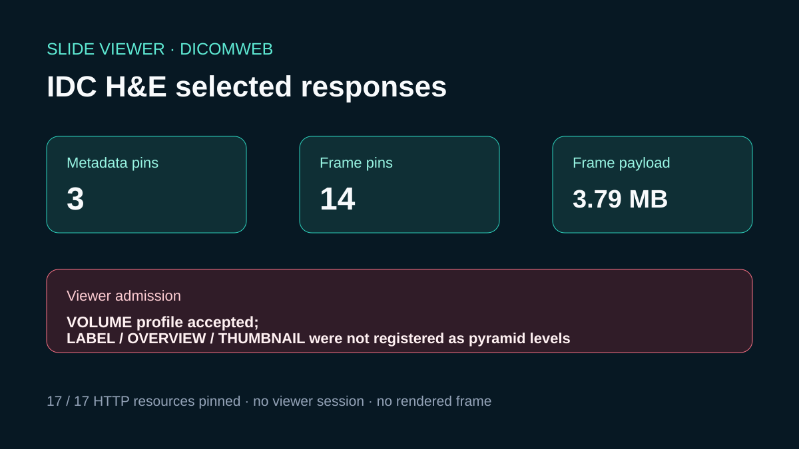

# IDC DICOMweb WSI: complete response pins

## Scientific question

Can a public IDC WSI selection with three SM instances be identified, completely pinned at its selected delivery representations, and opened by the current Slide Viewer DICOMweb adapter?

## Source observations

- The IDC v24 selection manifest records three SM instances for an FFPE H&E series under CC BY 4.0.
- A direct anonymous QIDO request returned the expected three SOP Instance UIDs.
- Instance metadata reported 12, 1, and 1 frames. The 12-frame VOLUME object uses 256 × 256 JPEG Baseline tiles for an 853 × 693 matrix; the two single-frame associated objects use native Explicit VR Little Endian delivery.
- The three metadata and fourteen frame responses all returned HTTP 200, with no ETags.

## Deterministic result

The compact manifest pins all 17 required resources: three metadata documents and fourteen exact multipart payloads. The frame payloads total 3,791,810 bytes. Every size and SHA-256 is retained in `outputs/dicomweb-representation-manifest.json`.

## Actual Slide Viewer checks

The guarded QIDO call rejected the server response as not honoring its bounded request. A single-instance inspection reported a source-change condition. Opening the three pinned SOPs then rejected the selection because the current adapter does not register LABEL, OVERVIEW, or THUMBNAIL objects as pyramid levels. No viewer session or rendered frame was returned.

## Rosalind Workbench observation

`mcp__rosalind__rosalind_open` was genuinely invoked with the pinned IDC response context. Its exact response and timestamp are retained in `outputs/rosalind-open-observation.json`. The operation opened the Rosalind task chooser only; it did not select or execute a scientific job and supplies no scientific result for this case.

## Scientific interpretation

The retained package demonstrates selected-response identity and an explicit adapter compatibility result. It does not demonstrate a displayed slide or validate morphology.

## Reproduce

1. Read the IDC selection and proxy-policy records.
2. Repeat the exact anonymous QIDO and three metadata requests.
3. Retrieve every declared frame with its recorded Accept representation; hash the extracted multipart payload, not the variable MIME envelope.
4. Compare all 17 pins with the retained representation manifest.
5. Invoke `mcp__rosalind__rosalind_open` with the case-specific task context and retain the chooser response separately from scientific evidence.
6. Repeat the guarded Slide Viewer calls and preserve any changed admission result without inferring rendering.
