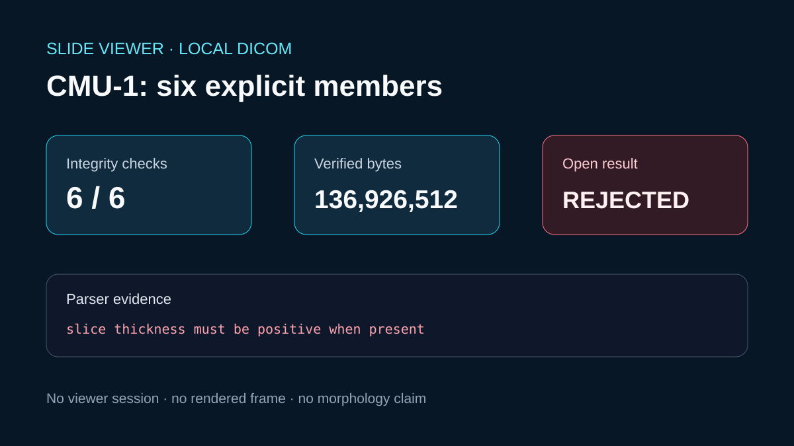

# Explicit CMU-1 local DICOM series

## Scientific question

Can the six publicly pinned CMU-1 DICOM WSI members be acquired exactly and admitted by the current Slide Viewer parser?

## Source observations

- The public inventory identifies six named DICOM members totaling 136,926,512 bytes and supplies a SHA-256 for each member.
- All six downloaded files matched the published byte counts and hashes on 2026-08-30.
- The source metadata describes a TILED_FULL JPEG 2000 conversion of the CC0 CMU-1 specimen.
- The current OpenSlide index marks the older source conversion deprecated because its Photometric Interpretation is incorrect; this package does not silently replace it with the newer v2 conversion.

## Actual Slide Viewer check

`mcp__slide_viewer__slide_open_dicom_series` received the six verified paths in order and returned `DICOM source slice thickness must be positive when present.` No viewer session was created. Source renewal and render checks therefore did not apply.

## Calculated result

The deterministic calculation is the sum of the six verified member sizes: 136,926,512 bytes.

## Rosalind Workbench observation

`mcp__rosalind__rosalind_open` was genuinely invoked with the local DICOM review context. Its exact response and timestamp are retained in `outputs/rosalind-open-observation.json`. The operation opened the Rosalind task chooser only; it did not select or execute a scientific job and supplies no scientific result for this case.

## Scientific interpretation

This case verifies source identity and a reproducible parser rejection. It does not show a DICOM pyramid, frame display, navigation behavior, or tissue morphology.

## Reproduce

1. Read `inputs/public-source.md` and the six-member receipt.
2. Download only the six listed members into an ignored workspace directory.
3. Verify every byte count and SHA-256 before opening.
4. Pass the six explicit paths to `mcp__slide_viewer__slide_open_dicom_series`.
5. Invoke `mcp__rosalind__rosalind_open` with the case-specific task context and retain the chooser response separately from scientific evidence.
6. Record the returned viewer error or, if a future version accepts the source, continue with state and render checks using the newly issued session.
