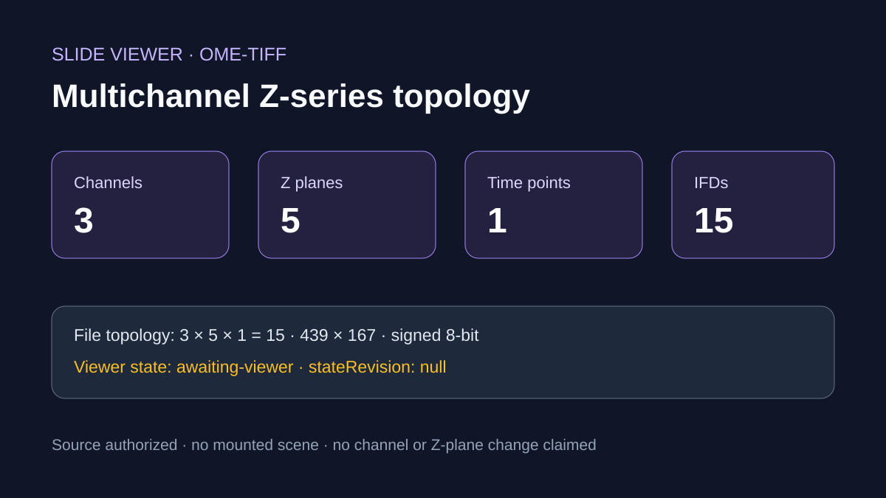

# Official OME-TIFF multichannel Z-series

## Scientific question

Does the official synthetic OME-TIFF contain a self-consistent C/Z/T plane map, and what did the current Slide Viewer session actually acknowledge?

## Source observations

- The publisher served the exact 1,128,003-byte TIFF under the collection's CC BY 4.0 notice.
- The downloaded file has SHA-256 `f8cebdb6036060e433576bd0303f6f632fac6f2a71f2e7ceec08a13f34f69cba`.
- Embedded OME-XML reports `XYZCT`, 439 × 167 pixels, C=3, Z=5, T=1, signed 8-bit pixels, and fifteen explicit TIFF data entries.
- `tiffinfo 4.7.1` independently reported fifteen IFDs with matching plane dimensions.

## Calculated result

`3 channels × 5 Z planes × 1 time point = 15 planes`, matching both the OME-XML mapping and TIFF directory count.

## Actual Slide Viewer check

The OME-TIFF open operation authorized a source and issued a session, but the viewer remained `awaiting-viewer` with no state revision. State, layer, and microscopy-scene queries timed out. A render wait was not possible without a state revision.

## Rosalind Workbench observation

`mcp__rosalind__rosalind_open` was genuinely invoked with the verified OME-TIFF topology context. Its exact response and timestamp are retained in `outputs/rosalind-open-observation.json`. The operation opened the Rosalind task chooser only; it did not select or execute a scientific job and supplies no scientific result for this case.

## Scientific interpretation

The file topology is internally consistent and suitable for future C/Z navigation testing. No channel, Z plane, layer, or visible image claim is made from the current session.

## Reproduce

1. Verify the HTTPS headers, byte count, and local SHA-256.
2. Extract the first TIFF ImageDescription, parse the OME-XML, and count its TIFF data entries.
3. Count TIFF directories with `tiffinfo` and compare them with C × Z × T.
4. Invoke `mcp__rosalind__rosalind_open` with the case-specific task context and retain the chooser response separately from scientific evidence.
5. Open the one explicit member. Continue to scene and render checks only if the viewer reports a current state revision.
