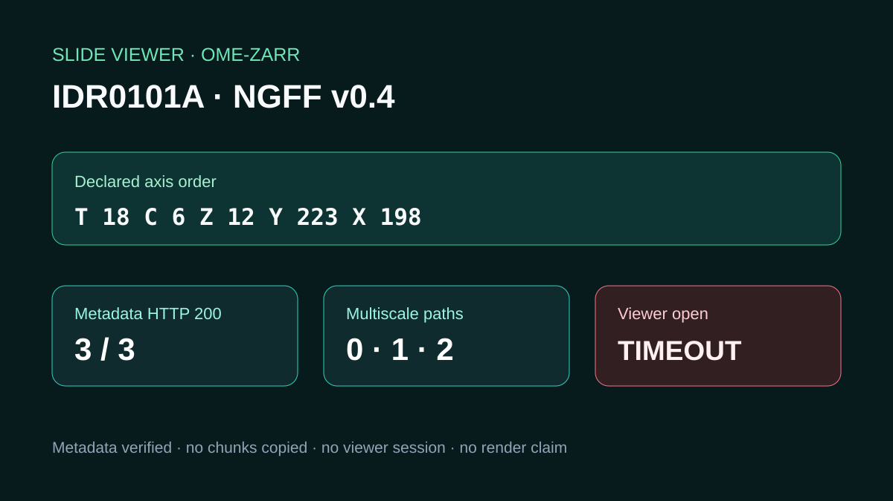

# IDR NGFF v0.4 remote metadata

## Scientific question

Can a public IDR NGFF v0.4 image be characterized reproducibly from a compact metadata read, and did the current viewer create a usable session?

## Source observations

- The IDR catalogue records image `13457537` in `idr0101A` under CC BY 4.0.
- `.zgroup`, `.zattrs`, and `0/.zarray` each returned HTTP 200 with strong quoted ETags.
- NGFF metadata declares axes `t,c,z,y,x`, dataset paths `0`, `1`, and `2`, plus coordinate transforms for each level.
- Level 0 is unsigned 16-bit with shape `[18, 6, 12, 223, 198]` and chunks `[1, 1, 1, 223, 198]`.

## Calculated result

Mapping the level-0 shape through the declared axes gives T=18, C=6, Z=12, Y=223, X=198. The three checked metadata objects total 6,708 bytes.

## Actual Slide Viewer checks

Passing `consistency=metadata-and-object-validators` produced a schema validation error stating that directory consistency is not a public HTTPS option. Retrying the same root without that field timed out and returned no viewer session. No scene, selection, layer, or render query was therefore possible.

## Rosalind Workbench observation

`mcp__rosalind__rosalind_open` was genuinely invoked with the bounded IDR NGFF review context. Its exact response and timestamp are retained in `outputs/rosalind-open-observation.json`. The operation opened the Rosalind task chooser only; it did not select or execute a scientific job and supplies no scientific result for this case.

## Scientific interpretation

The source metadata supports a reproducible description of the remote array topology and geometry. Coordinate transforms alone do not demonstrate biological alignment, and the current checks do not demonstrate viewer rendering.

## Reproduce

1. Fetch only the three named metadata objects.
2. Compare response status, bytes, hashes, ETags, and Last-Modified values.
3. Parse axis order, multiscale dataset paths, shape, chunks, and transforms.
4. Invoke `mcp__rosalind__rosalind_open` with the case-specific task context and retain the chooser response separately from scientific evidence.
5. Repeat the viewer open request with the currently advertised public-root arguments and report the actual outcome.
