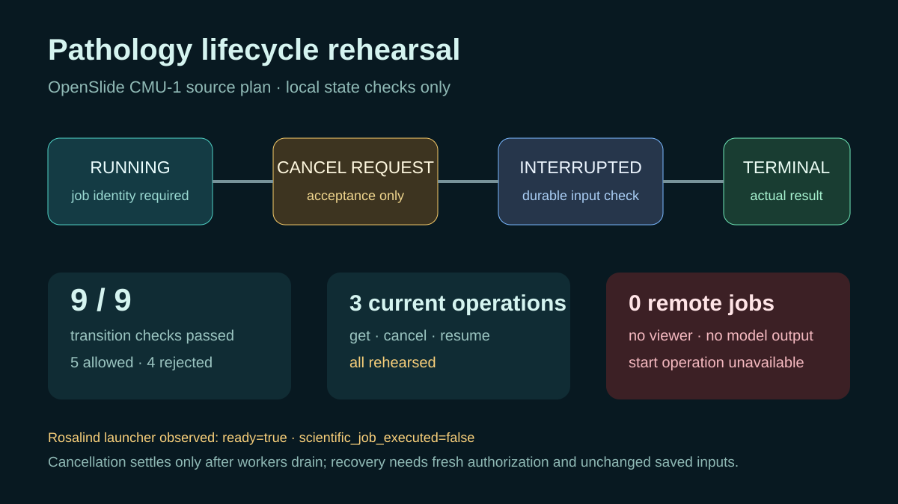

# Pathology job lifecycle rehearsal

## Scientific question

Which state evidence would be required to inspect, cancel, or recover a bounded pathology research job without confusing request acceptance with completed work?

## Public-source plan

`inputs/public-source.md` records OpenSlide CMU-1, its CC0-1.0 status, published byte count, and SHA-256. `inputs/pathology-plan.json` keeps the planned operation kind unset because the current Slide Viewer contract does not expose a pathology start operation. The 132.6 MB slide was not downloaded.

## Local computation

`outputs/pathology-state-machine.json` defines nine states, ten allowed transitions, and four lifecycle invariants. `outputs/state-transition-checks.csv` contains nine deterministic test cases: five permitted transitions and four rejected shortcuts. Running `python validate_case.py` verifies the source pin, current capability list, absence of a start operation, and every transition row.

## Rosalind Workbench observation

`outputs/rosalind-open-observation.json` records a genuine case-specific call to `mcp__rosalind__rosalind_open` at `2026-08-29T17:56:30.706Z`. The exact response was “Rosalind Workbench is ready. Choose a research task in the app.” with `ready=true`. This opened the task chooser only; it did not execute pathology analysis or any other scientific job.

## Current Slide Viewer operations

- `slide-viewer.slide_get_pathology` — rehearsed
- `slide-viewer.slide_cancel_pathology` — rehearsed
- `slide-viewer.slide_resume_pathology` — rehearsed

No viewer session or pathology job was created. No remote operation was called.

## Interpretation

The checks show why cancellation needs a separate worker-drain observation and why a terminally cancelled job cannot be reused as the recovery example. A recoverable interruption requires a durable identity, unchanged saved inputs, fresh authorization, and a new attempt identity.

## Limitations

- This is a local state-machine validation, not a pathology analysis.
- No tissue pixels, regions, components, predictions, or diagnostic evidence were inspected.
- The planned operation remains unset until a later installed contract advertises a supported exact kind.
- Any later execution needs its own source, job, attempt, artifact, and terminal-status records.

## Reproduce

1. Run `python validate_case.py` from this directory.
2. Confirm `outputs/local-validation.json` reports nine passing transition cases and no viewer execution.
3. Inspect `outputs/state-transition-checks.csv` and compare each row with `outputs/pathology-state-machine.json`.
4. In a later authorized viewer session, record actual tool results separately; do not edit this rehearsal to imply that a job ran.
