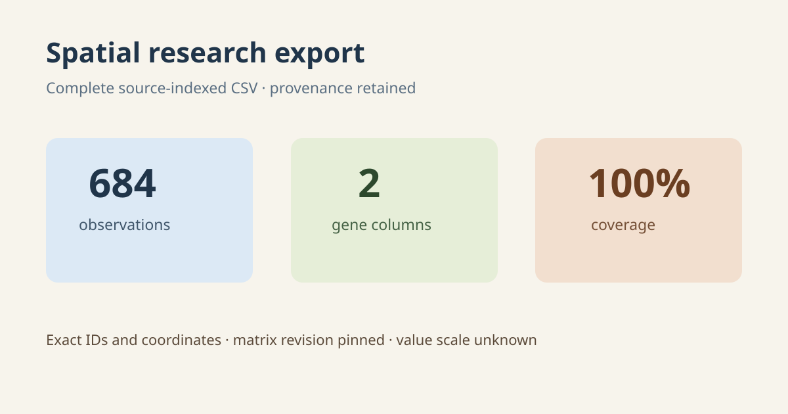

# Source-preserving spatial research export

## Scientific question

Can the complete spatial observation table and selected expression values be exported with sufficient provenance for independent inspection?

## Source observations

- The licensed H5AD exposes 684 observations, 18,078 genes, obsm/spatial coordinates, and CSR matrix X.
- Every observation is marked in tissue; coordinate ranges are x = 130–3433 and y = 98–3330.

## Computed results

outputs/spatial-observations-expression.csv contains 684 data rows with exact observation index and identifier, a JSON-protected identifier companion, coordinates, tissue flag, total_counts, n_genes_by_counts, and indexed Slc17a7 and Gad1 values. Coverage is 684/684. The CSV is 81,802 bytes and matches the SHA-256 in outputs/export-provenance.json.

Independent CSV checks reproduce mean values of 2.711 for Slc17a7 and 1.072 for Gad1. Their maxima are 4.055 and 3.950, respectively.

## Interpretation

The export preserves row identity, spatial coordinates, QC annotations, matrix revision, and gene indices needed to inspect the selected variables. Matrix value scale remains unknown, so the numerical columns are described only as values from X.

## Rosalind Workbench observation

The genuine case-specific `mcp__rosalind__rosalind_open` call completed at `2026-08-29T18:13:03.867Z` and returned exactly `Rosalind Workbench is ready. Choose a research task in the app.` with `ready=true`. The arguments, timestamps, response, and limitation are preserved in `outputs/rosalind-open-observation.json`.

The call opened only the task chooser. It did not read the H5AD, create the CSV, export source pixels, or execute a Rosalind scientific job.

## Limitations

The viewer did not expose a native export action during the pending render. The CSV was therefore created from guarded source-indexed reads rather than from a viewer-generated region export, and it contains no user-drawn region.
