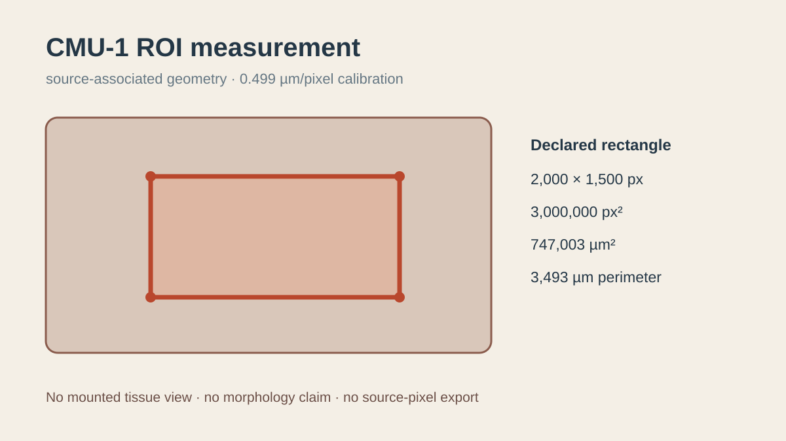

# ROI geometry and calibrated measurement

## Scientific question

Can an inspectable region geometry produce reproducible pixel and physical measurements while preserving its exact source association?

## Source observations

- The reused CC0 CMU-1 source is 132,565,343 bytes and matches SHA-256 `9a1923cd...3420`.
- Retained TIFF metadata identifies a 46,000 × 32,893 base-level image and 0.499 µm/pixel calibration.
- `outputs/roi-example.geojson` declares the source hash, base-level pixel frame, and a rectangular polygon from (12,000, 8,000) to (14,000, 9,500).

## Computed results

The rectangle measures 2,000 × 1,500 pixels. The shoelace area is 3,000,000 px² and the perimeter is 7,000 px. Applying the retained 0.499 µm/pixel calibration gives 747,003 µm² and 3,493 µm. The calculations are listed in `outputs/measurement-example.csv` and checked in `outputs/roi-measurement-receipt.json`.

## Interpretation

The files demonstrate source-associated geometry and reproducible measurement arithmetic. They are suitable for testing import/export schemas and measurement readers without making a tissue statement.

## Rosalind Workbench observation

The genuine case-specific `mcp__rosalind__rosalind_open` call completed at `2026-08-29T18:13:03.869Z` and returned exactly `Rosalind Workbench is ready. Choose a research task in the app.` with `ready=true`. `outputs/rosalind-open-observation.json` preserves the arguments, timestamps, response, and limitation.

This call opened only the task chooser. It did not draw an ROI, inspect tissue, calculate measurements, export source pixels, or execute a Rosalind scientific job.

## Slide Viewer action status

The CMU-1 source was previously authorized, but that session remained `awaiting-viewer`. ROI drawing, annotation editing, undo/redo, measurement export, and portable-project export are documented rehearsal steps and were not executed in a mounted viewer.

## Limitations

- The rectangle was generated from declared coordinates, not from a current user gesture.
- No image-bearing view was available for this region; there is no morphology interpretation.
- No user source-image capture or export permission was recorded, and no source pixels were exported.
- The physical values depend on the retained 0.499 µm/pixel source metadata.

## Reproduce

1. Verify the shared CMU-1 file against `inputs/public-source.md`.
2. Read the GeoJSON ring in order and recompute width, height, shoelace area, and Euclidean perimeter.
3. Apply 0.499 µm/pixel and compare with the CSV and JSON receipt.
4. If a mounted viewer is available later, draw a fresh ROI and record its authoritative annotation history separately from this deterministic example.
