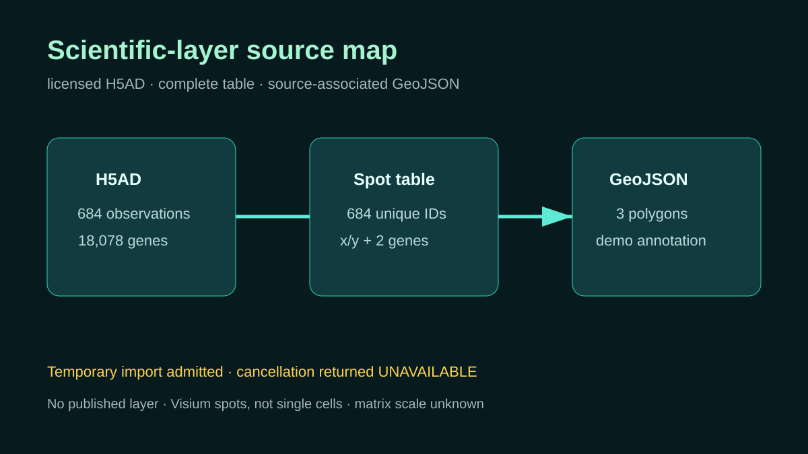

# Source-associated scientific layer

## Scientific question

Can the retained mouse-brain observation table and demonstration geometry be mapped to the correct source, coordinate frame, matrix revision, and entity semantics before viewer import?

## Source observations

- The verified CC BY 4.0 H5AD has 684 observations, 18,078 genes, and spatial coordinates in `obsm/spatial`.
- The reused CSV has 684 unique observation identifiers and complete source-indexed coverage.
- The reused GeoJSON has three polygons tied to exact observation identifiers and the same H5AD SHA-256 and matrix revision.

## Verified mapping

`outputs/layer-source-map.json` assigns the table rows to `visium_capture_spot` entities, maps x/y to registered source-image pixels, preserves the JSON-protected observation identifier, and records the exact matrix selector and revision. The GeoJSON is retained as companion demonstration annotation geometry; it is not cell segmentation.

`outputs/scientific-layer-receipt.json` records byte counts, hashes, row and feature counts, and the earlier status of each viewer action. `outputs/scientific-layer-cancellation-evidence.json` and `outputs/operation-provenance.json` retain a later temporary import, cancellation request, and status follow-up with portable task aliases and exact response text.

## Interpretation

The temporary GeoJSON import returned a real task in its authorizing phase. The subsequent `slide_cancel_scientific_layer_import` request returned `UNAVAILABLE`, and the follow-up reported revoked read authorization. The plugin did not provide a settled cancellation confirmation or a published layer descriptor.

## Rosalind Workbench observation

The genuine case-specific `mcp__rosalind__rosalind_open` call completed at `2026-08-29T18:13:03.868Z` and returned exactly `Rosalind Workbench is ready. Choose a research task in the app.` with `ready=true`. Its arguments, timestamps, response, and limitation are retained in `outputs/rosalind-open-observation.json`.

The call opened only the task chooser. It did not import, list, render, or query a scientific layer and did not execute a Rosalind scientific job.

## Limitations

- Visium observations are capture spots, not single cells.
- Matrix `X` has an unknown value scale.
- The three GeoJSON polygons are demonstration neighborhoods, not biological regions or segmentation.
- A temporary import, cancellation request, and status follow-up were called; cancellation completion was not confirmed.
- Layer listing, entity lookup, and authorization renewal were not called in the fresh session.
- No tissue frame was rendered, so no spatial pattern or morphology is interpreted.

## Reproduce

1. Verify all three reused artifacts against `inputs/public-source.md` and the receipt.
2. Check that CSV identifiers and coordinates match the declared H5AD association.
3. Validate the GeoJSON source hash, matrix revision, feature count, and coordinate frame.
4. In a later mounted session, import a fresh authorized layer and record returned IDs and status separately.
5. Read `outputs/scientific-layer-cancellation-evidence.json` before describing the temporary task; do not convert its `UNAVAILABLE` response into a completed cancellation claim.
