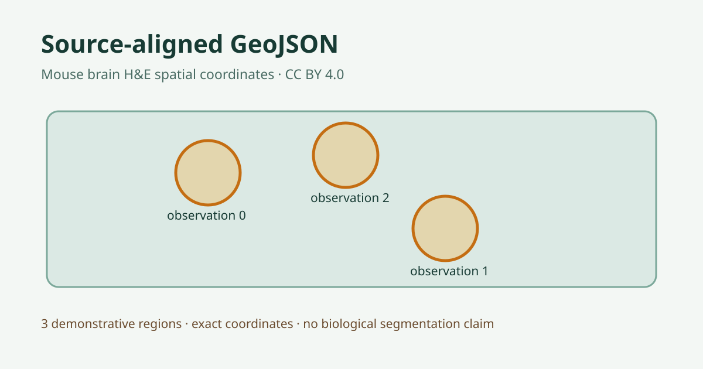

# Source-aligned spatial annotation overlay

## Scientific question

Can a spatially compatible annotation artifact be produced from exact H5AD coordinates while retaining source association and scientific meaning?

## Source observations

- The public H5AD contains 684 Visium observations registered through obsm/spatial to its H&amp;E image.
- Observation indices 0, 1, and 2 have exact coordinates (1575, 98), (2538, 1774), and (1850, 98).

## Computed results

outputs/source-aligned-annotations.geojson contains three 16-segment circular polygons with a 55-pixel radius around those coordinates. Dataset hash, matrix revision, coordinate frame, observation identifiers, and construction method are retained with the artifact.

## Interpretation

The artifact demonstrates reproducible source-associated overlay geometry. It is an annotation example derived from spot coordinates and does not represent cell segmentation, anatomical regions, or biological classifications.

## Rosalind Workbench observation

The genuine case-specific `mcp__rosalind__rosalind_open` call completed at `2026-08-29T18:13:03.866Z` and returned exactly `Rosalind Workbench is ready. Choose a research task in the app.` with `ready=true`. `outputs/rosalind-open-observation.json` retains the arguments, timestamps, response, and limitation.

The operation opened only the task chooser. It did not create, import, render, or classify the GeoJSON overlay and did not execute a Rosalind scientific job.

## Limitations

The viewer remained pending and did not expose an annotation import action during this run, so the GeoJSON was inspected structurally but was not rendered over the tissue image.
