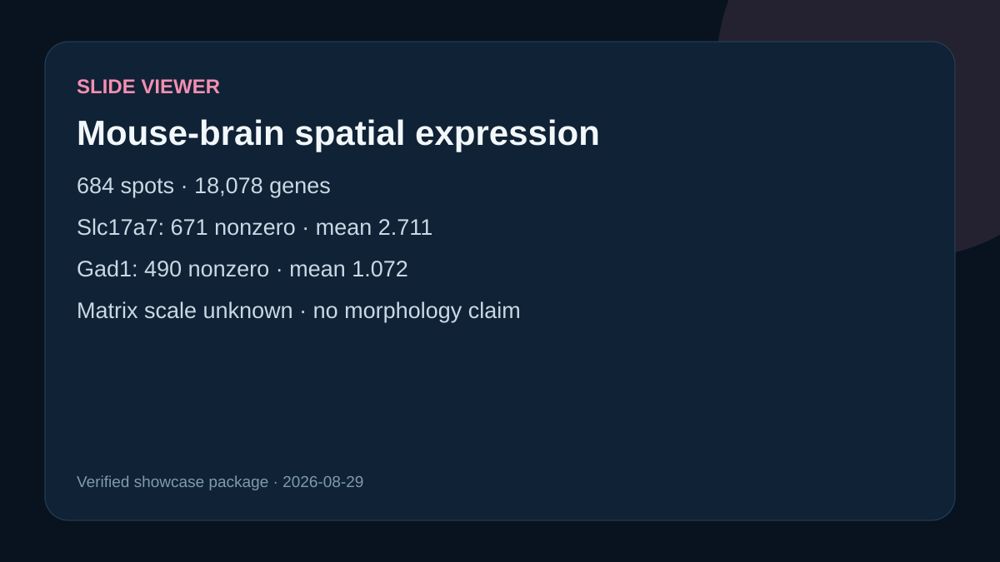

# Codex showcase lesson: Mouse-brain spatial expression

## Session prompt

Use $showcase-teacher to import and teach the ready showcase `slide-spatial-expression` (Mouse-brain spatial expression). Inspect its README, manifest, prompt, inputs, outputs, previews, and provenance records. Clearly distinguish source observations, computed results, scientific interpretation, and limitations, and show the preview when useful.

## Catalogue record

- Showcase ID: `slide-spatial-expression`
- Plugin: `slide-viewer` (Slide Viewer v0.1.56)
- Status: `ready`
- Domain: `genomics-and-pathology`
- Case type: `analysis`
- Difficulty: `advanced`
- Evidence level: `computed-result`
- Covered operations: `slide-viewer.slide_open_from_chat`, `slide-viewer.slide_spatial_indexed`, `slide-viewer.slide_query_viewer`, `rosalind.rosalind_open`
- Rosalind tasks: none recorded
- Actual tools: `Slide Viewer and local Python`, `Rosalind Workbench mcp__rosalind__rosalind_open`
- Summary: Indexed Slc17a7 and Gad1 expression summaries for a licensed public H5AD.
- Recorded next step: Open the case README to inspect the verified evidence, results, and limitations.
- Plugin guide: `showcases/slide-viewer/README.md`

## Repository files to inspect

- case guide: `showcases/slide-viewer/cases/slide-spatial-expression/README.md`
- case manifest: `showcases/slide-viewer/cases/slide-spatial-expression/showcase.json`
- teaching prompt: `showcases/slide-viewer/cases/slide-spatial-expression/prompt.md`
- output: `showcases/slide-viewer/cases/slide-spatial-expression/outputs/source-provenance.json`
- output: `showcases/slide-viewer/cases/slide-spatial-expression/outputs/metadata-summary.json`
- output: `showcases/slide-viewer/cases/slide-spatial-expression/outputs/expression-summary.json`
- output: `showcases/slide-viewer/cases/slide-spatial-expression/outputs/rosalind-open-observation.json`
- output: `showcases/slide-viewer/cases/slide-spatial-expression/outputs/teaching-bundle.md`
- output: `showcases/slide-viewer/cases/slide-spatial-expression/outputs/analysis-operation-availability.json`
- output: `showcases/slide-viewer/cases/slide-spatial-expression/outputs/operation-provenance.json`
- preview: `showcases/slide-viewer/cases/slide-spatial-expression/previews/spatial-expression.svg`

## Public sources

- https://exampledata.scverse.org/squidpy/visium_hne_adata_crop.h5ad
- https://doi.org/10.6084/m9.figshare.13604177.v1
- https://www.10xgenomics.com/datasets/mouse-brain-section-coronal-1-standard-1-1-0

## Retained case guide

# Mouse-brain spatial expression

## Scientific question

Can the spatial matrix be queried reproducibly for two neuronal marker genes, and what can be stated before tissue morphology is visible?

## Source observations

- The licensed public H5AD contains 684 observations and 18,078 genes.
- Matrix `X` is CSR with shape 684 × 18,078; spatial coordinates are present in `obsm/spatial`.
- The indexed genes are Slc17a7 (index 7717) and Gad1 (index 1607).

## Computed results

Across all 684 indexed observations, Slc17a7 was nonzero in 671 with mean 2.711 and maximum 4.055. Gad1 was nonzero in 490 with mean 1.072 and maximum 3.950. The matrix value scale is unspecified, so these are descriptive matrix values rather than raw-count or normalized-expression claims.

## Interpretation

The two genes are queryable over the complete indexed observation set. The viewer did not render a tissue frame, so no anatomical localization, morphology, or co-localization conclusion is made.

## Exploratory analysis operation availability

`outputs/analysis-operation-availability.json` and `outputs/operation-provenance.json` record a fresh capability response for `slide.run_analysis_from_chat`, `slide.get_analysis_from_chat`, and `slide.cancel_analysis_from_chat`. The capability response advertised all three, but the guarded run operation was not callable in this task. No same-session analysis task existed, so get and cancel were not called with a fabricated or borrowed identifier.

## Rosalind Workbench observation

The genuine case-specific `mcp__rosalind__rosalind_open` call completed at `2026-08-29T18:13:03.865Z` and returned exactly `Rosalind Workbench is ready. Choose a research task in the app.` with `ready=true`. Its arguments, timestamps, response, and limitation are retained in `outputs/rosalind-open-observation.json`.

This call opened only the task chooser. It did not query the H5AD, calculate expression summaries, render tissue, or execute a Rosalind scientific job; the public source observations and retained computation remain the evidence for the scientific statements above.

The analysis-operation availability record does not change the retained expression values and supplies no new computation.

## Attribution

Giovanni Palla (2021), *Brain Coronal HnE Adata Crop*, Figshare v1, CC BY 4.0. DOI and original 10x dataset links are retained in `outputs/source-provenance.json`.

## Retained execution prompt

# Prompt

Open the licensed public mouse-brain spatial H5AD, verify its indexed matrix and coordinates, and summarize Slc17a7 and Gad1 values without inferring morphology that was not rendered. Inspect `outputs/analysis-operation-availability.json`, `outputs/operation-provenance.json`, and `outputs/teaching-bundle.md`; explain that the run operation was not callable, so no legitimate analysis task existed for get or cancel. Do not fabricate or borrow a workflow identifier. Inspect `outputs/rosalind-open-observation.json` separately and state that its task-chooser response confirms only Workbench readiness.

## Teaching note

Use this bundle to locate the evidence. Read the listed repository artifacts before presenting scientific claims, and keep observations, calculations, interpretation, and limitations distinct.
