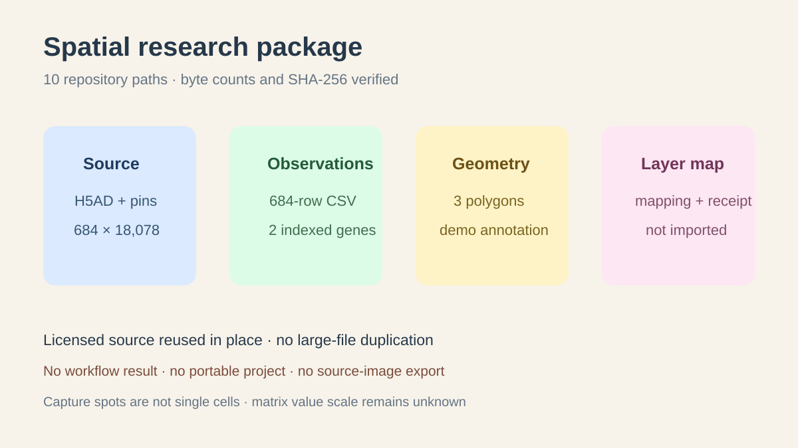

# Spatial research package

## Scientific question

Which retained artifacts make the licensed mouse-brain spatial observations, selected expression values, source-associated geometry, and scientific-layer mapping independently inspectable?

## Package contents

`outputs/research-package-inventory.json` references ten existing artifacts by repository path, byte count, SHA-256, role, and source association:

- the shared 94,259,482-byte H5AD source;
- source provenance, matrix metadata, and expression summaries;
- the complete 684-row observation CSV and export provenance;
- three demonstration GeoJSON polygons and their provenance;
- the scientific-layer source map and its action-status receipt.

The large H5AD, CSV, and GeoJSON stay in their original locations. The inventory is a reproducibility manifest, not a second data bundle.

## Verification

`outputs/package-validation.json` records that all ten paths existed on 2026-08-30 and matched the inventoried byte counts and hashes. It also records common H5AD and matrix identities where applicable.

## Interpretation

The inventory preserves the information needed to locate and verify the source, full spot table, selected values, demonstration geometry, and proposed scientific-layer mapping. It is useful for review, teaching, or a later authorized viewer session.

## Rosalind Workbench observation

The genuine case-specific `mcp__rosalind__rosalind_open` call completed at `2026-08-29T18:13:03.871Z` and returned exactly `Rosalind Workbench is ready. Choose a research task in the app.` with `ready=true`. `outputs/rosalind-open-observation.json` retains the arguments, timestamps, response, and limitation.

This call opened only the task chooser. It did not assemble or export the package, inspect source pixels, run a workflow, or execute a Rosalind scientific job.

## Action status and omissions

- The existing expression and export artifacts came from guarded indexed reads; the tissue frame was not rendered.
- The scientific-layer import, polling, listing, and entity queries remain rehearsed contracts.
- No supported workflow was run, so there is no workflow job or workflow artifact receipt.
- No portable project or annotation ZIP was produced.
- No current user source-image capture permission was recorded, and no source-image pixels were exported.

## Scientific limits

- Visium observations are capture spots, not single cells.
- Matrix `X` has an unknown value scale.
- The three polygons are demonstration annotations, not biological segmentation.
- The inventory does not establish visible tissue alignment or anatomical interpretation.

## Reproduce

1. Resolve each repository path in `research-package-inventory.json` from the project root.
2. Compare current bytes and SHA-256 with the recorded values.
3. Check that H5AD hash and matrix revision associations agree across the retained JSON and GeoJSON files.
4. Treat any later workflow, layer import, project export, or source-image export as a new execution with its own receipt.
