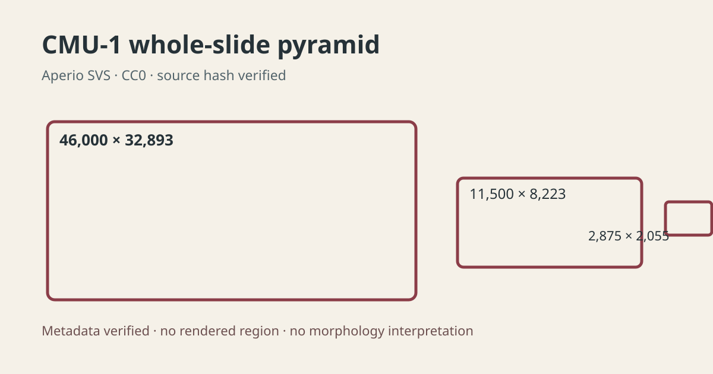

# CMU-1 whole-slide source and pyramid

## Scientific question

Can a public Aperio H&amp;E slide be acquired reproducibly and its multiresolution structure verified before region-level visual interpretation?

## Source observations

- The CC0 CMU-1 SVS file is 132,565,343 bytes and matches the pinned SHA-256 recorded in outputs/source-provenance.json.
- TIFF metadata reports a 46,000 × 32,893 tiled RGB main image, 240 × 240 tiles, 20× objective metadata, and 0.499 µm/pixel.
- Two reduced whole-slide levels measure 11,500 × 8,223 and 2,875 × 2,055; thumbnail, label, and macro associated images are also present.

## Computed results

The verified pyramid has nominal downsample factors of 1, 4, and 16. These dimensions and the associated-image inventory are retained in outputs/pyramid-metadata.json.

## Interpretation

The source is suitable for reproducible whole-slide navigation tests. The authorized Slide Viewer session remained in awaiting-viewer, so this case makes no tissue-architecture or morphology statement.

## Attribution

CMU-1 is distributed through the OpenSlide test-data collection under CC0-1.0. The large source binary remains outside Git.
