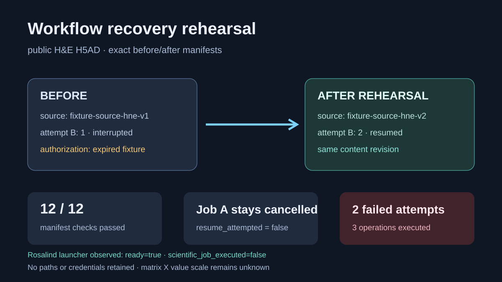

# Codex showcase lesson: Saved workflow recovery

## Session prompt

Use $showcase-teacher to import and teach the ready showcase `slide-workflow-recovery` (Saved workflow recovery). Inspect its README, manifest, prompt, inputs, outputs, previews, and provenance records. Clearly distinguish source observations, computed results, scientific interpretation, and limitations, and show the preview when useful.

## Catalogue record

- Showcase ID: `slide-workflow-recovery`
- Plugin: `slide-viewer` (Slide Viewer v0.1.56)
- Status: `ready`
- Domain: `genomics-and-pathology`
- Case type: `recovery`
- Difficulty: `advanced`
- Evidence level: `computed-result`
- Covered operations: `slide-viewer.slide_cancel_workflow`, `slide-viewer.slide_get_workflow`, `slide-viewer.slide_get_live_workflow`, `slide-viewer.slide_resume_workflow`, `slide-viewer.slide_import_workflow_source`, `slide-viewer.slide_run_workflow`, `slide-viewer.slide_list_workflows`, `rosalind.rosalind_open`
- Rosalind tasks: none recorded
- Actual tools: `local Python JSON and CSV validation`, `Rosalind Workbench mcp__rosalind__rosalind_open`
- Summary: How are saved inputs reauthorized before a microscopy workflow resumes?
- Recorded next step: Open the case README and inspect the public source, receipt, preview, interpretation, and limitations.
- Plugin guide: `showcases/slide-viewer/README.md`

## Repository files to inspect

- case guide: `showcases/slide-viewer/cases/slide-workflow-recovery/README.md`
- case manifest: `showcases/slide-viewer/cases/slide-workflow-recovery/showcase.json`
- teaching prompt: `showcases/slide-viewer/cases/slide-workflow-recovery/prompt.md`
- input: `showcases/slide-viewer/cases/slide-workflow-recovery/inputs/public-source.md`
- input: `showcases/slide-viewer/cases/slide-workflow-recovery/inputs/recovery-before.json`
- input: `showcases/slide-viewer/cases/slide-workflow-recovery/inputs/recovery-after.json`
- input: `showcases/slide-viewer/cases/slide-workflow-recovery/inputs/temporary-region-counts.tsv`
- input: `showcases/slide-viewer/cases/slide-workflow-recovery/inputs/temporary-region-annotations.tsv`
- output: `showcases/slide-viewer/cases/slide-workflow-recovery/outputs/recovery-state-machine.json`
- output: `showcases/slide-viewer/cases/slide-workflow-recovery/outputs/manifest-diff.csv`
- output: `showcases/slide-viewer/cases/slide-workflow-recovery/outputs/local-validation.json`
- output: `showcases/slide-viewer/cases/slide-workflow-recovery/outputs/rosalind-open-observation.json`
- output: `showcases/slide-viewer/cases/slide-workflow-recovery/outputs/workflow-operation-evidence.json`
- output: `showcases/slide-viewer/cases/slide-workflow-recovery/outputs/operation-provenance.json`
- output: `showcases/slide-viewer/cases/slide-workflow-recovery/outputs/teaching-bundle.md`
- preview: `showcases/slide-viewer/cases/slide-workflow-recovery/previews/preview.svg`

## Public sources

- https://exampledata.scverse.org/squidpy/visium_hne_adata_crop.h5ad
- https://doi.org/10.6084/m9.figshare.13604177.v1

## Retained case guide

# Workflow recovery manifest rehearsal

## Scientific question

Which fields must remain stable, and which identities must change, when a saved microscopy workflow is recovered under fresh source authorization?

## Source and fixtures

`inputs/public-source.md` identifies the CC BY 4.0 mouse-brain H&E H5AD by URL, byte count, and SHA-256. `inputs/recovery-before.json` and `inputs/recovery-after.json` contain no local path or credential. They model two separate jobs:

- job A has completed cancellation and remains terminal;
- job B is recoverable and receives a new source alias and attempt identity while retaining the same public source, matrix, durable ID, and source revision.

## Local validation

`outputs/manifest-diff.csv` records twelve exact comparisons. `outputs/recovery-state-machine.json` states the permitted cancellation and recovery sequences. Running `python validate_case.py` verifies every comparison and writes `outputs/local-validation.json`.

## Guarded Slide Viewer execution

`outputs/workflow-operation-evidence.json` records the guarded arguments, timestamps, portable request digests, returned states, and terminal errors for a fresh temporary execution. `slide_import_workflow_source` issued a read-only source for `inputs/temporary-region-counts.tsv`. Two `slide_run_workflow` attempts used `inputs/temporary-region-annotations.tsv`; both were admitted, then failed in the normalization phase with `ABORTED: The isolated workflow exited without a complete typed result.` `slide_list_workflows` returned the corresponding process-local state. Opaque session, source, task, and durable identifiers are represented by case-local aliases because they have no scientific meaning.

Neither task committed a typed summary or an artifact descriptor. `slide_read_workflow_artifact` and `slide_read_live_workflow_artifact` were therefore not called, and an internal task identifier was not substituted for an artifact identifier. `outputs/operation-provenance.json` and `outputs/teaching-bundle.md` provide the file index and teaching context.

## Rosalind Workbench observation

`outputs/rosalind-open-observation.json` records a genuine case-specific call to `mcp__rosalind__rosalind_open` at `2026-08-29T17:56:30.726Z`. The exact response was “Rosalind Workbench is ready. Choose a research task in the app.” with `ready=true`. This opened the task chooser only; it did not resume a workflow or execute another scientific job.

## Current Slide Viewer operations

- `slide-viewer.slide_cancel_workflow` — rehearsed
- `slide-viewer.slide_get_workflow` — rehearsed
- `slide-viewer.slide_get_live_workflow` — rehearsed
- `slide-viewer.slide_resume_workflow` — rehearsed
- `slide-viewer.slide_import_workflow_source` — executed successfully
- `slide-viewer.slide_run_workflow` — admitted twice; both tasks later failed
- `slide-viewer.slide_list_workflows` — executed successfully
- `slide-viewer.slide_read_workflow_artifact` — unavailable because no authentic artifact descriptor was issued
- `slide-viewer.slide_read_live_workflow_artifact` — unavailable because no guarded artifact page was cached

The earlier recovery fixtures remain distinct from the fresh temporary execution.

## Interpretation

The comparison preserves the scientific content identity while separating historical and current authorization aliases. The fresh receipts add direct evidence for read-only source issuance, task admission, process-local listing, and terminal failure reporting.

## Limitations

- The original source aliases and task identities remain fixtures; the fresh temporary task aliases represent plugin responses without publishing internal handles.
- No workflow completed, so there is no normalized result or workflow artifact page.
- Matrix `X` value scale remains unknown.
- A real recovery must revalidate its own source permissions and supported workflow kind.
- The temporary regional tables are synthetic execution controls and provide no biological result.

## Reproduce

1. Run `python validate_case.py` from this directory.
2. Confirm all twelve rows in `outputs/manifest-diff.csv` report `pass`.
3. Compare the job A and job B rules with `outputs/recovery-state-machine.json`.
4. Keep any later live workflow output separate. Preserve transport identities only in restricted raw evidence; use portable aliases in public teaching artifacts.
5. Inspect `outputs/workflow-operation-evidence.json`, `outputs/operation-provenance.json`, and `outputs/teaching-bundle.md` before teaching the execution result.

## Retained execution prompt

# Validate a workflow recovery rehearsal

Compare the self-contained before/after manifests for cancellation job A and recoverable job B. Then inspect `outputs/workflow-operation-evidence.json`, `outputs/operation-provenance.json`, and `outputs/teaching-bundle.md` for the separate temporary execution. Report the successful read-only source import, both admitted region-QC tasks, the process-local list result, and the repeated isolated-worker failure exactly. Explain that workflow artifact reads were not attempted because no completed task supplied an authentic artifact descriptor. Treat opaque task and source aliases as transport details, and preserve `outputs/rosalind-open-observation.json` as an independent task-chooser observation.

## Teaching note

Use this bundle to locate the evidence. Read the listed repository artifacts before presenting scientific claims, and keep observations, calculations, interpretation, and limitations distinct.
